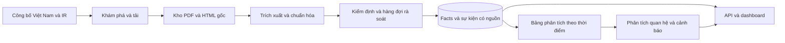

# Thiết kế hệ thống BCTC–cổ tức Việt Nam

> **Trạng thái 03/10/2026 — hồ sơ khảo sát trước.** Project hiện hành tập trung thu thập, kiểm định và phân tích lợi nhuận–dòng tiền–cổ tức tiền mặt. Xem [SRS hiện hành](../research-platform/02-de-tai-va-srs.md) và [phương pháp thống nhất](../research-platform/11-phuong-phap-thu-thap-va-xu-ly.md). Các ngưỡng cảnh báo, dự báo, scope và lịch cũ bên dưới chỉ để tham khảo; không là yêu cầu MVP hiện hành.

Phiên bản 2.0 — 03/10/2026. Yêu cầu tham chiếu: [SRS](SRS-FDP-01.md). Đây là thiết kế đề xuất cho ý tưởng mới, chưa phải mô tả code đã triển khai.

## 1. Kiến trúc và lựa chọn kỹ thuật

Một pipeline Python chạy theo lô, PostgreSQL lưu dữ liệu, FastAPI cung cấp truy vấn. Dashboard React tối thiểu; có thể dùng Streamlit ở pilot để sớm kiểm tra dữ liệu. Chỉ duy trì một giao diện khi chốt MVP.

Công cụ đề xuất: requests/httpx cho tải HTTP, BeautifulSoup cho HTML, pdfplumber cho PDF có text, pandas cho bảng phân tích, pytest cho kiểm thử. Trình duyệt tự động chỉ thêm khi nguồn pilot thực sự cần; OCR là nhánh mở rộng sau khi đã đo tỷ lệ PDF scan.



## 2. Các module cần xây dựng

| Module | Đầu vào → đầu ra | Yêu cầu |
|---|---|---|
| sources | Danh sách công ty/năm → URL tài liệu/sự kiện | VN-FR-01, 02 |
| archive | URL → bản gốc, hash, metadata | VN-FR-03 |
| extract | Bản gốc → các ứng viên chỉ tiêu và vị trí | VN-FR-04 |
| normalize | Ứng viên → facts chuẩn VND và kỳ báo cáo | VN-FR-05 |
| validate/review | Facts → cờ lỗi, quyết định duyệt và sửa | VN-FR-06 |
| dividends | Thông báo → sự kiện, sửa lịch, trạng thái bằng chứng | VN-FR-07 |
| dataset | Facts/sự kiện → firm-year, feature và label | VN-FR-08, 12 |
| analytics | Dataset → thống kê, quy tắc và case study | VN-FR-09, 10 |
| api/ui | Dữ liệu đã duyệt → truy vấn, biểu đồ, nguồn | VN-FR-11 |
| modeling | Dataset đủ điều kiện → baseline và đánh giá | VN-FR-13 |

Thứ tự triển khai theo bảng. Pilot đi qua toàn bộ chuỗi cho một doanh nghiệp trước khi tăng số lượng.

## 3. Mô hình dữ liệu

Dùng khóa company_id ổn định; ticker là thuộc tính, tránh coi đổi mã là đổi doanh nghiệp. Giá trị tiền lưu NUMERIC, không dùng số thực dấu phẩy động cho facts gốc.

| Bảng | Trường chính và mục đích |
|---|---|
| company | company_id, ticker, name, market, industry, cohort_status, exclusion_reason |
| crawl_run | run_id, source, started_at, config_version, status, error |
| source_document | document_id, company_id, source_url, published_at, publication_precision, retrieved_at, document_type, report_scope, audit_status |
| document_file | file_id, document_id, hash_sha256, local_path, mime_type, downloaded_at |
| raw_extracted_fact | raw_id, file_id, page_number, locator, original_label, raw_value, raw_unit, raw_period, method, parser_version |
| metric_definition | metric_code, display_name, statement_type, unit, sign_convention |
| metric_label_mapping | label_pattern, statement_type, metric_code, mapping_version |
| financial_fact | fact_id, raw_id, company_id, metric_code, period_start, period_end, report_scope, value_vnd, available_at, validation_status |
| dividend_event | event_id, company_id, dividend_type, profit_year, announced_at, record_date, scheduled_payment_date, confirmed_payment_date, cash_dps, nominal_value, status |
| dividend_event_source | event_id, document_id, locator, claim_type; nối nhiều thông báo với một sự kiện |
| data_quality_issue | issue_id, entity_type, entity_id, rule_code, severity, status, resolution |
| review_decision | decision_id, entity_id, old_value, new_value, reviewer, reason, reviewed_at |
| dataset_snapshot | snapshot_id, config_version, created_at, manifest_hash, cohort_description |
| firm_year_observation | snapshot_id, company_id, report_year, cutoff_at, outcome_start/end, feature_status, label, label_reason, event_ids |
| score_result | snapshot_id, company_id, cutoff_at, rule_version, score, completeness, reasons |

Một document có nhiều file/phiên bản; file có nhiều raw facts; mỗi fact chuẩn nối về ứng viên gốc. Sự kiện có nhiều tài liệu chứng minh; không đếm lại thông báo đổi lịch thành cổ tức mới.

Ràng buộc duy nhất của fact: company, metric, period, scope, source version và parser version. Dedupe tài liệu bằng URL/hash; dedupe sự kiện bằng đối chiếu công ty, loại, kỳ cổ tức và ngày quyền, có hàng đợi xử lý xung đột.

## 4. Ngày khả dụng và phiên bản

available_at là ngày công bố xác định từ nguồn; không suy ra từ cuối năm tài chính. publication_precision thể hiện ngày chính xác, khoảng thời gian hoặc chưa xác định. Mẫu không có ngày đủ tin cậy bị loại khỏi đánh giá theo thời điểm.

Khi nguồn có đính chính, giữ cả hai bản và chọn bản đã khả dụng tại cutoff_at. Không dùng bản sửa công bố sau cutoff để xây feature quá khứ. retrieved_at chỉ là thời điểm hệ thống tải.

Kho raw được giữ để tái xử lý. Những số sửa thủ công luôn có quyết định sửa và bằng chứng, không ghi đè mất lịch sử.

## 5. Quy trình parser và kiểm định

1. Nhận diện doanh nghiệp, năm, phạm vi hợp nhất/riêng và trạng thái kiểm toán.
2. Tìm đơn vị ở trang/bảng; không coi đơn vị toàn tài liệu luôn áp dụng mọi bảng.
3. Xác định tiêu đề cột năm hiện tại/năm so sánh; lấy đúng cột.
4. Tìm chỉ tiêu theo nhãn, loại báo cáo và mã số nếu có; nhãn mơ hồ giữ nhiều ứng viên.
5. Parse số âm, ngoặc, dấu phân cách và quy đổi đơn vị.
6. Kiểm tra tổng tài sản ≈ nợ phải trả + vốn chủ sở hữu với dung sai theo độ làm tròn nguồn.
7. Cờ xung đột, thiếu kỳ/phạm vi/đơn vị được đưa sang review. Chỉ facts đủ điều kiện mới đi vào tính chỉ số.

confidence_score của parser thể hiện mức chắc chắn thao tác trích xuất, không thay thế kiểm chứng độc lập.

## 6. Sự kiện và phân tích cổ tức

Trạng thái: proposed, scheduled, confirmed_paid, postponed, cancelled, unknown. advance_cash là đặc điểm đợt tạm ứng, không tự chứng minh đã trả.

Quy đổi cash_dps từ số tiền/cổ phiếu hoặc tỷ lệ × mệnh giá nguồn. Theo dõi từng đợt trả; nếu cộng theo năm lợi nhuận phải biết profit_year. Nếu cộng theo cửa sổ thời gian phải ghi rõ phương pháp.

Chỉ số lõi: CFO/LNST khi LNST > 0; CFO/tổng tài sản; tiền/nợ phải trả; nợ phải trả/tổng tài sản; nợ phải trả/vốn chủ sở hữu khi vốn > 0; biến động DPS đã đủ điều kiện so sánh. Coverage và payout chỉ tính khi dữ liệu mở rộng đủ.

Không bù thiếu bằng 0. Không mặc định một giá trị doanh nghiệp–năm là kết quả dự báo đã quan sát hoàn chỉnh.

## 7. API và giao diện

| Endpoint đọc | Nội dung |
|---|---|
| GET /companies | Danh sách, ngành, trạng thái độ phủ |
| GET /companies/{ticker}/financials | Facts theo năm/phạm vi, nguồn, trạng thái duyệt |
| GET /companies/{ticker}/dividends | Các đợt, DPS, lịch và trạng thái thực hiện |
| GET /companies/{ticker}/dividend-risk | Chỉ số, điểm, lý do, cutoff, độ đầy đủ |
| GET /data-quality/coverage | Mẫu số, tỷ lệ thiếu/duyệt/sửa và loại lỗi |
| GET /documents/{id} | Metadata và vị trí bằng chứng/bản gốc |
| GET /datasets/{snapshot_id}/manifest | Phạm vi và phiên bản dataset |

Response dùng data và meta: snapshot_id, cutoff_at, rule_version, missing_reasons. Không gán nhãn rủi ro thấp cho công ty chưa có đủ dữ liệu.

Ba màn hình: danh sách công ty; chi tiết BCTC–cổ tức–cảnh báo với nguồn; chất lượng dữ liệu. Duyệt dữ liệu có thể dùng CLI và bảng review trong MVP, chưa cần giao diện quản trị riêng.

## 8. Cấu trúc triển khai đề xuất

```text
src/
  sources/ archive/ extract/ normalize/ validate/
  dividends/ dataset/ analytics/ api/
tests/
data/
  raw/ processed/ snapshots/
reports/
  quality/ analysis/ evaluation/
```

Đây là cấu trúc cần triển khai, không khẳng định thư mục/module đã có. Bản gốc lớn lưu ngoài Git kèm manifest/hash. Quản lý phụ thuộc bằng requirements/lockfile; lệnh chạy từng bước có cấu hình công ty, năm, snapshot. Docker chỉ thêm sau khi chuỗi chạy ổn định.
