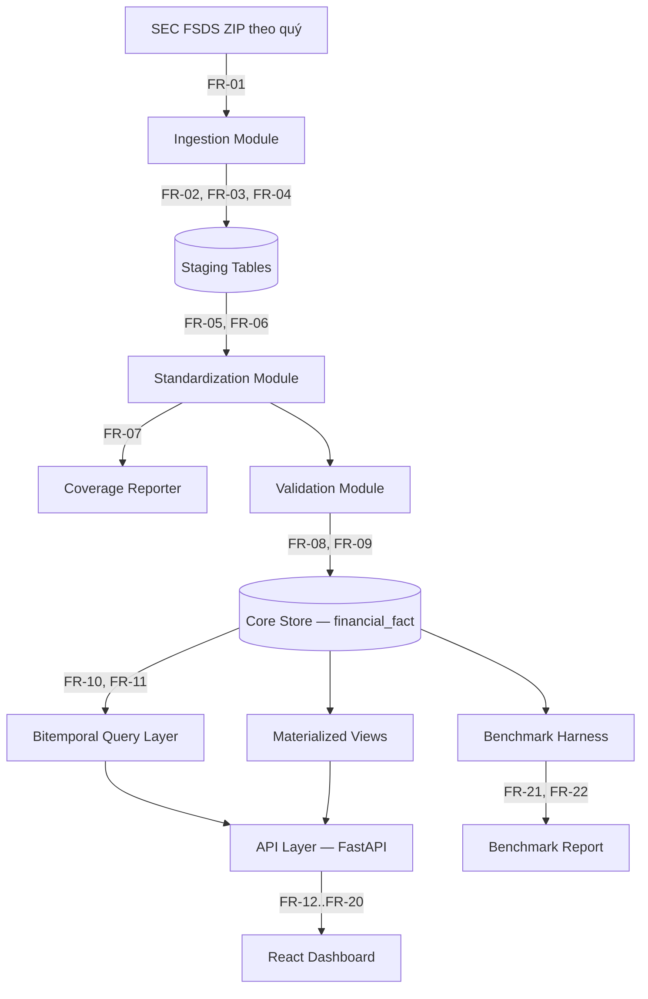
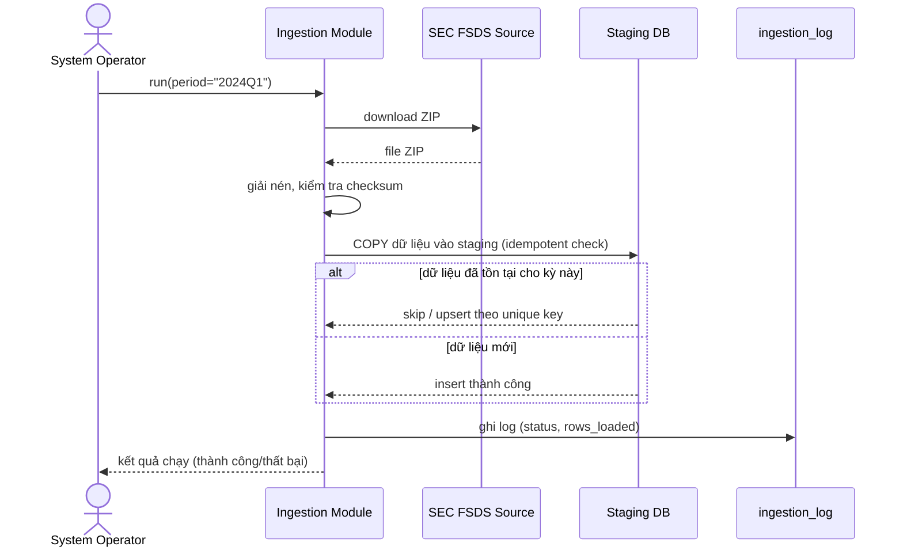
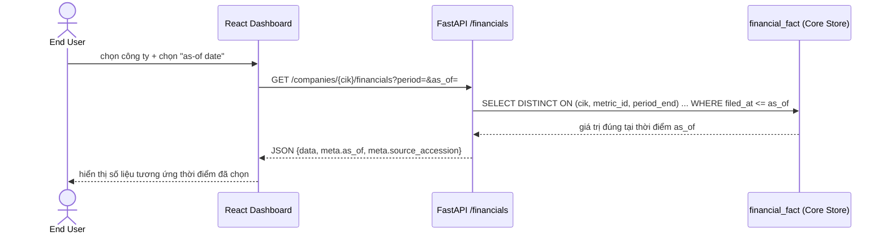

# SOFTWARE DESIGN DOCUMENT (SDD)
## Financial Data Platform

**Document ID:** SDD-FDP-01
**Version:** 1.0
**Tài liệu gốc tham chiếu:** SRS-FDP-01
**Chuẩn tham chiếu:** cấu trúc theo IEEE 1016 (Software Design Description)

*Tài liệu này đặc tả HỆ THỐNG ĐƯỢC XÂY DỰNG NHƯ THẾ NÀO (how) để thỏa mãn các yêu cầu đã nêu trong SRS-FDP-01. Mỗi quyết định thiết kế quan trọng được nối lại với FR/NFR tương ứng.*

---

## 1. Introduction

### 1.1 Purpose
Trình bày kiến trúc hệ thống, thiết kế dữ liệu, thiết kế thành phần và các quyết định công nghệ, làm cơ sở để lập trình và để giảng viên đánh giá năng lực thiết kế hệ thống.

### 1.2 Scope
Bao phủ toàn bộ các Feature trong SRS-FDP-01 Mục 4. Không lặp lại nội dung yêu cầu, chỉ tham chiếu bằng mã FR/NFR.

### 1.3 Design Goals & Constraints
- Ưu tiên đơn giản, dễ bảo trì bởi một người thực hiện (constraint: NFR-05).
- Tách rõ ràng vùng dữ liệu thô (staging) khỏi vùng dữ liệu đã xử lý (core store) để hỗ trợ tái xử lý khi logic thay đổi.
- Không dùng kiến trúc phân tán (constraint từ SRS 2.5).

---

## 2. System Architecture

### 2.1 Architecture Style
**Layered monolith** — một ứng dụng backend duy nhất, chia thành các layer/module rõ trách nhiệm, chạy cùng một tiến trình. Lựa chọn này thỏa mãn NFR-05 (maintainability bởi 1 người) mà không cần độ phức tạp vận hành của microservices.

### 2.2 High-level Architecture Diagram



### 2.3 Component Responsibilities

| Component | Trách nhiệm | FR/NFR liên quan |
|---|---|---|
| Ingestion Module | Tải, giải nén, nạp dữ liệu thô vào staging; ghi log | FR-01–FR-04, NFR-03 |
| Standardization Module | Ánh xạ dữ liệu thô về canonical metrics | FR-05–FR-07 |
| Validation Module | Áp dụng rule chất lượng, gắn cờ vi phạm | FR-08–FR-09 |
| Core Store | Lưu trữ bitemporal, nguồn sự thật duy nhất | FR-10–FR-11, NFR-04 |
| Bitemporal Query Layer | Xử lý logic truy vấn as-of | FR-15 |
| Materialized Views | Phẳng hóa dữ liệu phục vụ truy vấn nhanh | NFR-01, NFR-02 |
| API Layer | Expose REST endpoints | FR-12–FR-20 |
| Benchmark Harness | Đo & ghi lại hiệu năng truy vấn | FR-21–FR-22 |
| React Dashboard | Giao diện người dùng | FR-23–FR-27 |

### 2.4 Design Rationale — Bitemporal Storage
**Vấn đề (từ FR-10, FR-11):** dữ liệu tài chính có thể được điều chỉnh sau khi công bố; lưu trữ ghi đè sẽ làm mất khả năng biết "hệ thống đã biết gì tại thời điểm X".

**Phương án đã xem xét:**

| Phương án | Ưu điểm | Nhược điểm | Quyết định |
|---|---|---|---|
| A. Bảng rộng, ghi đè khi có update | Đơn giản, quen thuộc | Mất lịch sử, không thỏa FR-10 | Loại |
| B. Bảng lịch sử riêng (audit table) song song bảng chính | Giữ được lịch sử | Phức tạp khi query, 2 nguồn sự thật | Loại |
| **C. Fact table long-format, mỗi thay đổi là 1 dòng mới, phân biệt bằng `filed_at`** | 1 nguồn sự thật duy nhất, query as-of tự nhiên bằng `WHERE filed_at <=` | Cần `DISTINCT ON`/window function khi lấy giá trị mới nhất, chi phí lưu trữ cao hơn | **Chọn** |

Phương án C được chọn vì trực tiếp thỏa mãn FR-10/FR-11 mà không cần đồng bộ hai nguồn dữ liệu.

### 2.5 Design Rationale — Staging tách khỏi Core Store
Nếu logic ánh xạ tag (FR-06) thay đổi giữa kỳ (gần như chắc chắn xảy ra), hệ thống cần rebuild lại Core Store mà **không phải tải lại dữ liệu nguồn**. Staging đóng vai trò dữ liệu thô bất biến, Core Store có thể xóa và build lại từ staging bất cứ lúc nào.

### 2.6 Sequence Diagrams

#### 2.6.1 Luồng Ingestion (UC-08, FR-01 → FR-04)



#### 2.6.2 Luồng Point-in-time Query (UC-06, FR-15)



---

## 3. Data Design

### 3.1 Entity Relationship Diagram

```
company (
    cik             VARCHAR(10) PK,
    name            VARCHAR(255),
    sic_code        VARCHAR(4),
    sic_description VARCHAR(255)
)

metric_definition (
    metric_id       SMALLSERIAL PK,
    code            VARCHAR(32) UNIQUE,     -- 'REVENUE', 'NET_INCOME'
    display_name    VARCHAR(64),
    statement_type  VARCHAR(16)             -- 'IS' | 'BS' | 'CF'
)

tag_mapping (
    xbrl_tag        VARCHAR(128) PK,
    metric_id       SMALLINT FK -> metric_definition,
    priority        SMALLINT DEFAULT 1
)

financial_fact (
    fact_id         BIGSERIAL PK,
    cik             VARCHAR(10) FK -> company,
    metric_id       SMALLINT FK -> metric_definition,
    period_end      DATE NOT NULL,
    fiscal_period   VARCHAR(8),             -- 'Q1' | 'FY'
    value           NUMERIC(24,4),
    filed_at        DATE NOT NULL,          -- transaction time (FR-11)
    accession_no    VARCHAR(20) NOT NULL,   -- truy vết filing gốc (FR-11)
    is_flagged      BOOLEAN DEFAULT FALSE,  -- (FR-09)
    flag_reason     VARCHAR(255),
    UNIQUE (cik, metric_id, period_end, filed_at, accession_no)
)

historical_price (
    cik             VARCHAR(10) FK -> company,
    trade_date      DATE,
    close_price     NUMERIC(12,4),
    PK (cik, trade_date)
)

ingestion_log (
    log_id          SERIAL PK,
    run_at          TIMESTAMP DEFAULT now(),
    period          VARCHAR(8),
    rows_loaded     INT,
    status          VARCHAR(16),
    error_message   TEXT
)
```

**Quan hệ:** `company (1) — (N) financial_fact`; `metric_definition (1) — (N) tag_mapping`; `metric_definition (1) — (N) financial_fact`.

### 3.2 Indexing Strategy (phục vụ NFR-01, NFR-02)

| Index | Trên bảng | Phục vụ truy vấn |
|---|---|---|
| `idx_fact_company_metric_period` | `financial_fact (cik, metric_id, period_end)` | FR-14, FR-16 |
| `idx_fact_filed_at` | `financial_fact (filed_at)` | FR-15 (as-of query) |
| PK tự nhiên | `historical_price (cik, trade_date)` | FR-17 |

### 3.3 Materialized View

```sql
CREATE MATERIALIZED VIEW mv_latest_metrics AS
SELECT DISTINCT ON (cik, metric_id, period_end)
    cik, metric_id, period_end, value
FROM financial_fact
WHERE is_flagged = FALSE
ORDER BY cik, metric_id, period_end, filed_at DESC;

CREATE INDEX ON mv_latest_metrics (cik, period_end);
```
Phục vụ FR-18, FR-19, FR-20 — tránh phải quét dạng long-format mỗi lần so sánh/lọc, trực tiếp phục vụ NFR-02.

### 3.4 Point-in-time Query Pattern (thiết kế cho FR-15)

```sql
SELECT DISTINCT ON (cik, metric_id, period_end)
    value, filed_at, accession_no
FROM financial_fact
WHERE cik = :cik
  AND period_end = :period_end
  AND filed_at <= :as_of_date
ORDER BY cik, metric_id, period_end, filed_at DESC;
```

### 3.5 Data Dictionary — Canonical Metrics (chi tiết cho FR-05)

| Code | Display Name | Statement Type |
|---|---|---|
| REVENUE | Doanh thu thuần | IS |
| NET_INCOME | Lợi nhuận ròng | IS |
| GROSS_PROFIT | Lợi nhuận gộp | IS |
| EPS | Lãi cơ bản trên cổ phiếu | IS |
| TOTAL_ASSETS | Tổng tài sản | BS |
| TOTAL_LIABILITIES | Tổng nợ phải trả | BS |
| TOTAL_EQUITY | Vốn chủ sở hữu | BS |
| OPERATING_CASH_FLOW | Dòng tiền hoạt động kinh doanh | CF |
| CAPEX | Chi đầu tư tài sản cố định | CF |
| SHARES_OUTSTANDING | Số cổ phiếu lưu hành | BS |

---

## 4. Interface Design

### 4.1 API Design (chi tiết hóa FR-12 → FR-20)

| Method | Endpoint | FR | Request | Response (tóm tắt) |
|---|---|---|---|---|
| GET | `/companies` | FR-12 | `?search=&page=&limit=` | Danh sách company |
| GET | `/companies/{cik}` | FR-13 | — | Company profile |
| GET | `/companies/{cik}/financials` | FR-14, FR-15 | `?period=&as_of=` | Giá trị canonical metrics |
| GET | `/companies/{cik}/trend` | FR-16 | `?metric=` | Chuỗi giá trị theo thời gian |
| GET | `/companies/{cik}/prices` | FR-17 | `?from=&to=` | Chuỗi giá đóng cửa |
| POST | `/compare` | FR-19 | `{ciks[], metrics[]}` | Bảng so sánh |
| POST | `/screen` | FR-20 | `{conditions[]}` | Danh sách company thỏa điều kiện |
| GET | `/metrics/coverage` | FR-07 | — | Bảng coverage |
| GET | `/ingestion/logs` | FR-04 | — | Lịch sử ingestion |

Response format thống nhất:
```json
{ "data": {...}, "meta": { "as_of": "2024-06-01", "source_accession": "0000320193-24-000123" } }
```

### 4.2 UI Design (chi tiết hóa FR-23 → FR-27)

| Màn hình | FR | Thành phần chính |
|---|---|---|
| Company Overview | FR-18, FR-23, FR-27 | Ô tìm kiếm, bảng chỉ tiêu chính, bộ chọn "as-of date" |
| Trend | FR-16, FR-24 | Biểu đồ đường (Recharts), chọn chỉ tiêu |
| Comparison | FR-19, FR-25 | Bảng nhiều cột, chọn 2–5 company |
| Screening | FR-20, FR-26 | Form điều kiện, bảng kết quả |

#### 4.2.1 Wireframe tối giản — Company Overview (màn hình quan trọng nhất)

```
┌─────────────────────────────────────────────┐
│  [ Tìm kiếm công ty ______________ ] [Search]│
├─────────────────────────────────────────────┤
│  AAPL — Apple Inc.          As-of: [📅 date] │
├─────────────────────────────────────────────┤
│  Revenue: $XXX B     Net Income: $XX B       │
│  ROE: XX%            Revenue Growth: XX%     │
├─────────────────────────────────────────────┤
│  [ Trend chart: Revenue 12 quý ]             │
├─────────────────────────────────────────────┤
│  [+ Thêm công ty để so sánh]                 │
└─────────────────────────────────────────────┘
```

*Ghi chú:* Với đồ án data platform, wireframe chỉ cần ở mức thấp (low-fidelity) như trên, đủ để hướng dẫn code — không cần dựng Figma chi tiết vì trọng tâm chấm điểm là tầng dữ liệu, không phải UI/UX (theo định vị sản phẩm ở SRS Mục 2.1).

---

## 5. Technology Stack & Justification

| Layer | Công nghệ | Đáp ứng yêu cầu nào | Lý do chọn |
|---|---|---|---|
| Data pipeline | Python 3.11 + Pandas | FR-01–FR-09 | Hệ sinh thái mạnh cho xử lý dữ liệu bảng, phù hợp Data Engineering |
| Database | PostgreSQL 15+ | FR-10, FR-11, NFR-01, NFR-02 | Hỗ trợ `NUMERIC` chính xác, materialized view, index nâng cao cần cho bitemporal + benchmark |
| Backend/API | FastAPI | FR-12–FR-20 | Cùng ngôn ngữ với pipeline; tự sinh OpenAPI docs |
| Frontend | React + Recharts | FR-23–FR-27 | Người thực hiện đã có sẵn kỹ năng |
| Testing | Pytest | NFR-06 | Chuẩn cho hệ sinh thái Python |
| Containerization | Docker Compose | NFR-08 | Đảm bảo khả năng tái lập không cần Kubernetes |

---

## 6. Deployment View

```
docker-compose.yml
 ├── service: postgres        (port 5432)
 ├── service: backend (FastAPI) (port 8000)
 └── service: frontend (React, build tĩnh hoặc dev server) (port 3000)
```
Toàn bộ chạy trên một máy/VPS đơn giản, không yêu cầu orchestration.

---

## 7. Design Constraints Carried Forward from SRS
- 2.5 (SRS): không dùng kiến trúc phân tán → phản ánh ở Mục 2.1 (layered monolith).
- NFR-05: maintainability → phản ánh ở việc chia module theo Mục 2.3.
- NFR-08: reproducibility → phản ánh ở Mục 6.

---

## Change Log

| Version | Ngày | Nội dung thay đổi |
|---|---|---|
| 1.0 | | Bản phát hành đầu tiên, tách từ tài liệu gộp SRS trước đó |
