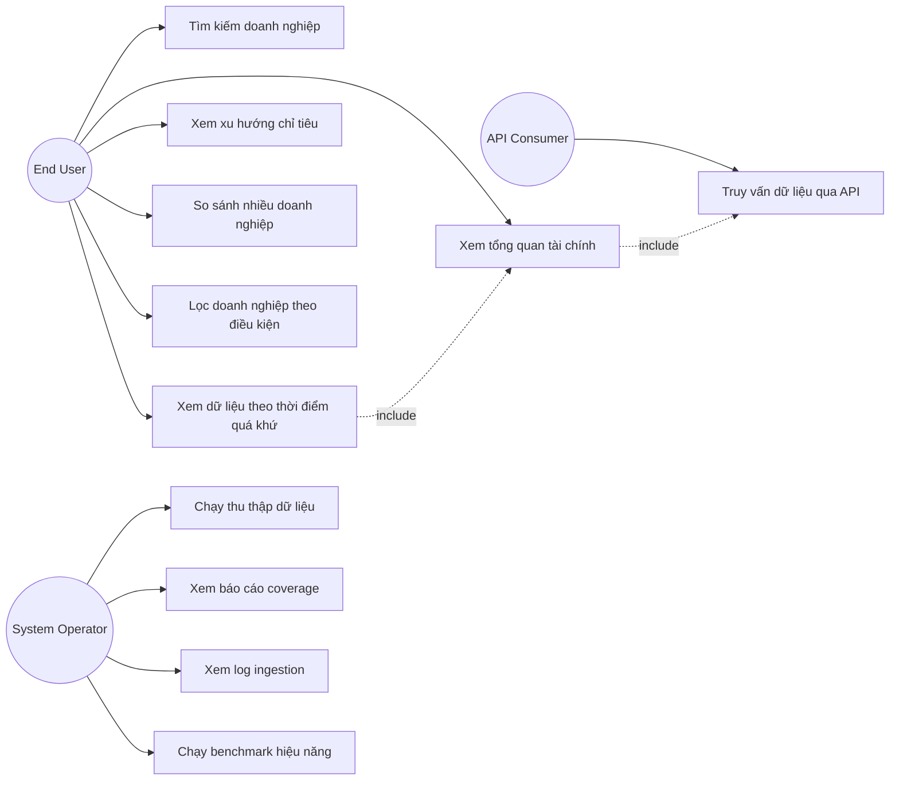

# SOFTWARE REQUIREMENTS SPECIFICATION (SRS)
## Financial Data Platform

**Document ID:** SRS-FDP-01
**Version:** 1.0
**Chuẩn tham chiếu:** IEEE 830-1998 / ISO/IEC/IEEE 29148:2018
**Trạng thái:** Draft — chờ phê duyệt

*Tài liệu này chỉ đặc tả HỆ THỐNG PHẢI LÀM GÌ (what). Cách hệ thống được xây dựng (kiến trúc, công nghệ, schema chi tiết) nằm trong SDD-FDP-01. Cách kiểm thử nằm trong TP-FDP-01. Lịch trình thực hiện nằm trong PP-FDP-01.*

---

## 1. Introduction

### 1.1 Purpose
Tài liệu này đặc tả đầy đủ yêu cầu chức năng và phi chức năng của hệ thống Financial Data Platform, làm cơ sở cho thiết kế (SDD), phát triển, kiểm thử (Test Plan) và nghiệm thu sản phẩm. Đối tượng đọc: sinh viên thực hiện, giảng viên hướng dẫn/phản biện.

### 1.2 Scope
Sản phẩm mang tên **Financial Data Platform (FDP)**. Hệ thống thu thập dữ liệu báo cáo tài chính doanh nghiệp công khai từ SEC Financial Statement Data Sets, xác thực, chuẩn hóa và lưu trữ có hỗ trợ truy vấn theo thời điểm lịch sử (point-in-time), cung cấp dữ liệu qua API và giao diện web.

Hệ thống **sẽ**:
- Thu thập, xác thực, chuẩn hóa dữ liệu tài chính từ nguồn công khai.
- Lưu trữ dữ liệu có khả năng truy vấn theo thời điểm lịch sử.
- Cung cấp API truy vấn và giao diện web tra cứu/so sánh/lọc doanh nghiệp cơ bản.

Hệ thống **sẽ không**:
- Đưa ra khuyến nghị đầu tư hoặc dự đoán giá cổ phiếu.
- Thực hiện định giá doanh nghiệp (DCF) hoặc tối ưu hóa danh mục đầu tư.
- Xử lý dữ liệu thời gian thực (real-time streaming).
- Cung cấp cơ chế xác thực/phân quyền cấp doanh nghiệp.

### 1.3 Definitions, Acronyms, Abbreviations

| Thuật ngữ | Định nghĩa |
|---|---|
| CIK | Central Index Key — mã định danh doanh nghiệp theo SEC |
| Fact | Một điểm dữ liệu số gắn với (doanh nghiệp, chỉ tiêu, kỳ báo cáo) |
| Filing | Hồ sơ báo cáo tài chính một doanh nghiệp nộp cho SEC |
| Restatement | Việc nộp lại báo cáo với số liệu điều chỉnh so với lần nộp trước |
| Point-in-time / As-of query | Truy vấn trả về dữ liệu đúng như hệ thống biết tại một thời điểm quá khứ |
| Canonical metric | Chỉ tiêu tài chính đã chuẩn hóa, dùng chung toàn hệ thống |
| XBRL | eXtensible Business Reporting Language — định dạng báo cáo tài chính điện tử theo chuẩn SEC |
| SRS | Tài liệu này |
| FR / NFR | Functional Requirement / Non-functional Requirement |

### 1.4 References
- SEC Financial Statement Data Sets — https://www.sec.gov/dera/data/financial-statement-data-sets
- IEEE Std 830-1998, Recommended Practice for Software Requirements Specifications
- ISO/IEC/IEEE 29148:2018, Systems and software engineering — Life cycle processes — Requirements engineering
- SDD-FDP-01 (tài liệu thiết kế đi kèm)
- TP-FDP-01 (tài liệu kế hoạch kiểm thử đi kèm)

### 1.5 Overview
Mục 2 mô tả tổng quan sản phẩm. Mục 3 đặc tả yêu cầu giao diện ngoài. Mục 4 đặc tả yêu cầu chức năng chi tiết theo từng nhóm nghiệp vụ. Mục 5 đặc tả yêu cầu phi chức năng. Mục 6 là các yêu cầu khác (pháp lý, dữ liệu). Phụ lục A là Data Dictionary, Phụ lục B là Traceability tóm tắt.

---

## 2. Overall Description

### 2.1 Product Perspective
FDP là hệ thống độc lập (standalone), không phải module của hệ thống lớn hơn. Hệ thống đóng vai trò trung gian giữa nguồn dữ liệu công khai (SEC) và người dùng cuối, tương tự về mặt chức năng với các sản phẩm tham khảo Nasdaq Data Fabric (data layer) và Economatica (analytics layer), nhưng ở quy mô và phạm vi thu hẹp phù hợp đồ án học kỳ.

```
[SEC Data Source] → [Financial Data Platform] → [End User / API Consumer]
```

### 2.2 Product Functions (tóm tắt cấp cao)
- Thu thập & chuẩn hóa dữ liệu tài chính (F1)
- Lưu trữ có hỗ trợ truy vấn point-in-time (F2)
- Truy vấn dữ liệu qua API (F3)
- Phân tích cơ bản: tổng quan, xu hướng, so sánh (F4)
- Đo lường & minh chứng hiệu năng truy vấn (F5)
- Hiển thị qua giao diện web (F6)

*(Chi tiết từng function được đặc tả thành FR trong Mục 4.)*

### 2.3 User Classes and Characteristics

| User Class | Đặc điểm | Tần suất sử dụng |
|---|---|---|
| End User (qua Dashboard) | Không cần kiến thức kỹ thuật, cần hiểu thuật ngữ tài chính cơ bản | Thường xuyên |
| API Consumer | Có kiến thức lập trình, tích hợp dữ liệu vào ứng dụng khác | Không thường xuyên |
| System Operator (sinh viên thực hiện) | Vận hành ingestion, theo dõi chất lượng dữ liệu | Định kỳ (theo lịch ingestion) |

### 2.4 Operating Environment
- Server: máy cá nhân hoặc VPS đơn giản, hệ điều hành Linux/Windows có Docker.
- Database: PostgreSQL 15+.
- Backend chạy trên Python 3.11+.
- Frontend chạy trên trình duyệt hiện đại (Chrome, Edge, Firefox bản mới).
- Không yêu cầu hạ tầng cloud production-scale.

### 2.5 Design and Implementation Constraints
- Người thực hiện: 1 sinh viên, trình độ Python mới bắt đầu, đã biết SQL cơ bản và React.
- Thời gian thực hiện: 1 học kỳ (16 tuần).
- Nguồn dữ liệu giới hạn ở SEC Financial Statement Data Sets (chỉ doanh nghiệp niêm yết tại Mỹ).
- Không sử dụng hạ tầng phân tán (Kafka, Spark, Kubernetes).
- Chi tiết kiến trúc, công nghệ cụ thể được quyết định trong SDD-FDP-01, không thuộc phạm vi tài liệu này.

### 2.6 Assumptions and Dependencies
- Nguồn dữ liệu SEC duy trì định dạng file và tính khả dụng như tại thời điểm viết tài liệu.
- Phạm vi 30 doanh nghiệp được chọn có đủ dữ liệu lịch sử tối thiểu 12 quý.
- Không có yêu cầu pháp lý bổ sung ngoài điều khoản sử dụng dữ liệu công khai của SEC.

### 2.7 Use Case Model

#### 2.7.1 Use Case Diagram



#### 2.7.2 Use Case Specifications (rút gọn)

| Use Case ID | Tên | Actor | FR liên quan | Tiền điều kiện | Luồng chính (tóm tắt) | Ngoại lệ |
|---|---|---|---|---|---|---|
| UC-01 | Tìm kiếm doanh nghiệp | End User | FR-12 | Hệ thống đã có dữ liệu công ty | User nhập từ khóa → hệ thống trả danh sách khớp | Không tìm thấy → trả danh sách rỗng, không lỗi |
| UC-02 | Xem tổng quan tài chính | End User | FR-13, FR-14, FR-18 | Đã chọn 1 công ty | User chọn công ty → hệ thống hiển thị chỉ tiêu chính + chỉ số phái sinh | Công ty thiếu dữ liệu 1 số chỉ tiêu → hiển thị "N/A", không crash |
| UC-03 | Xem xu hướng chỉ tiêu | End User | FR-16 | Đã ở màn Overview | User chọn 1 chỉ tiêu → hệ thống vẽ biểu đồ theo thời gian | Chỉ tiêu không đủ dữ liệu lịch sử → thông báo rõ ràng |
| UC-04 | So sánh nhiều doanh nghiệp | End User | FR-19 | Đã chọn 2–5 công ty | User chọn danh sách công ty + chỉ tiêu → hệ thống trả bảng so sánh | Chọn >5 công ty → hệ thống từ chối, báo giới hạn |
| UC-05 | Lọc doanh nghiệp theo điều kiện | End User | FR-20 | Coverage đủ cho chỉ tiêu được lọc | User nhập điều kiện → hệ thống trả danh sách thỏa mãn | Điều kiện không hợp lệ (VD: so sánh sai kiểu) → báo lỗi input |
| UC-06 | Xem dữ liệu theo thời điểm quá khứ | End User | FR-15, FR-27 | Đang xem Overview một công ty | User chọn ngày quá khứ → hệ thống trả giá trị đúng thời điểm đó | Ngày chọn trước khi công ty có dữ liệu → trả rỗng có kiểm soát |
| UC-07 | Truy vấn dữ liệu qua API | API Consumer | FR-12–FR-20 | Có API endpoint public | Gọi HTTP request → nhận JSON response | Request sai định dạng → trả lỗi 400 kèm thông báo |
| UC-08 | Chạy thu thập dữ liệu | System Operator | FR-01–FR-04 | Có kết nối tới nguồn dữ liệu | Operator chạy script theo quý → dữ liệu được nạp và log lại | Nguồn dữ liệu lỗi/không khả dụng → ghi log thất bại, không crash toàn hệ thống |
| UC-09 | Xem báo cáo coverage | System Operator | FR-07 | Đã có dữ liệu chuẩn hóa | Operator truy vấn coverage → xem tỷ lệ theo từng chỉ tiêu | — |
| UC-10 | Xem log ingestion | System Operator | FR-04 | Đã chạy ít nhất 1 lần ingestion | Operator truy vấn lịch sử chạy | — |
| UC-11 | Chạy benchmark hiệu năng | System Operator | FR-21, FR-22 | Dữ liệu đã nạp đủ quy mô tham chiếu | Operator chạy script benchmark → nhận bảng kết quả thời gian + query plan | — |

---

## 3. External Interface Requirements

### 3.1 User Interfaces
- Giao diện web (browser-based), responsive tối thiểu ở độ phân giải desktop phổ thông (1280px+).
- Ngôn ngữ hiển thị: tiếng Việt hoặc tiếng Anh (chọn 1, nhất quán toàn hệ thống).
- Không yêu cầu hỗ trợ thiết bị di động trong phạm vi đồ án này.

### 3.2 Hardware Interfaces
Không có yêu cầu giao tiếp phần cứng đặc biệt. Hệ thống chạy trên máy chủ/máy cá nhân thông thường.

### 3.3 Software Interfaces

| Interface | Mô tả | Giao thức |
|---|---|---|
| SEC Financial Statement Data Sets | Nguồn dữ liệu đầu vào, tải theo file ZIP định kỳ theo quý | HTTPS download |
| PostgreSQL Database | Lưu trữ dữ liệu hệ thống | TCP/IP, SQL |
| Internal REST API | Giao tiếp giữa Frontend và Backend | HTTP/JSON |

### 3.4 Communications Interfaces
- Giao tiếp API nội bộ qua HTTP/HTTPS, định dạng JSON.
- Không yêu cầu giao thức realtime (WebSocket, gRPC) trong phạm vi hệ thống.

---

## 4. System Features (Functional Requirements)

Mỗi Feature được trình bày theo mẫu chuẩn IEEE 830: **Description, Priority, Stimulus/Response, Functional Requirements chi tiết.**

### 4.1 Feature: Data Ingestion

**Description:** Hệ thống thu thập dữ liệu thô từ nguồn SEC theo chu kỳ quý.
**Priority:** High (Must Have)

| Mã | Yêu cầu | Input | Output mong đợi |
|---|---|---|---|
| FR-01 | Hệ thống PHẢI tải được file dữ liệu nguồn theo quý được chỉ định | Tham số quý (VD: 2024Q1) | File dữ liệu thô được tải và giải nén thành công |
| FR-02 | Hệ thống PHẢI nạp dữ liệu thô vào vùng lưu trữ tạm (staging) mà không làm mất hoặc sai lệch số lượng bản ghi | File dữ liệu thô đã giải nén | Số bản ghi trong staging khớp chính xác với số bản ghi trong file nguồn |
| FR-03 | Hệ thống PHẢI đảm bảo việc chạy lại ingestion cho cùng một kỳ dữ liệu không tạo ra bản ghi trùng lặp | Chạy ingestion 2 lần cho cùng 1 kỳ | Số bản ghi sau lần chạy thứ 2 không đổi |
| FR-04 | Hệ thống PHẢI ghi nhận lịch sử mỗi lần chạy ingestion, gồm tối thiểu: thời điểm chạy, kỳ dữ liệu, số bản ghi xử lý, trạng thái, thông báo lỗi (nếu có) | Mỗi lần chạy ingestion | 1 bản ghi log mới, truy vấn được |

### 4.2 Feature: Data Standardization

**Description:** Hệ thống chuẩn hóa dữ liệu thô về một tập chỉ tiêu tài chính thống nhất (canonical metrics).
**Priority:** High (Must Have)

| Mã | Yêu cầu | Input | Output mong đợi |
|---|---|---|---|
| FR-05 | Hệ thống PHẢI duy trì một danh mục cố định các chỉ tiêu tài chính chuẩn hóa (canonical metrics) | — | Danh mục chỉ tiêu có thể truy vấn được |
| FR-06 | Hệ thống PHẢI ánh xạ được các nhãn dữ liệu thô khác nhau về đúng một chỉ tiêu chuẩn hóa, xử lý được trường hợp một bản ghi thô có nhiều nhãn cùng ý nghĩa | Dữ liệu thô của 1 filing | Mỗi chỉ tiêu chuẩn hóa nhận đúng 1 giá trị duy nhất cho mỗi filing |
| FR-07 | Hệ thống PHẢI tính toán và cung cấp được tỷ lệ phần trăm dữ liệu được chuẩn hóa thành công cho mỗi chỉ tiêu (coverage) | Toàn bộ dữ liệu đã ánh xạ | Báo cáo coverage theo từng chỉ tiêu |

### 4.3 Feature: Data Quality Validation

**Description:** Hệ thống kiểm tra và đảm bảo chất lượng dữ liệu trước khi đưa vào lưu trữ chính thức.
**Priority:** High (Must Have)

| Mã | Yêu cầu | Input | Output mong đợi |
|---|---|---|---|
| FR-08 | Hệ thống PHẢI áp dụng tối thiểu 3 quy tắc kiểm tra chất lượng dữ liệu (giá trị bất hợp lệ, dữ liệu trùng lặp, giá trị bất thường so với lịch sử) | Dữ liệu đã chuẩn hóa | Bản ghi vi phạm được xác định chính xác |
| FR-09 | Hệ thống PHẢI đánh dấu (không xóa) các bản ghi vi phạm quy tắc chất lượng, kèm lý do vi phạm | Bản ghi vi phạm | Bản ghi được gắn cờ + lý do, vẫn truy vấn được |

### 4.4 Feature: Historical Data Storage (Point-in-time)

**Description:** Hệ thống lưu trữ dữ liệu tài chính theo cách bảo toàn lịch sử thay đổi, hỗ trợ truy vấn dữ liệu đúng như trạng thái đã biết tại một thời điểm quá khứ.
**Priority:** High (Must Have) — đây là yêu cầu cốt lõi phân biệt hệ thống với lưu trữ thông thường.

| Mã | Yêu cầu | Input | Output mong đợi |
|---|---|---|---|
| FR-10 | Hệ thống PHẢI lưu trữ được nhiều phiên bản giá trị cho cùng một (doanh nghiệp, chỉ tiêu, kỳ báo cáo) khi tồn tại báo cáo điều chỉnh, không được ghi đè giá trị trước đó | Filing điều chỉnh của cùng kỳ | Cả giá trị cũ và mới cùng tồn tại, phân biệt được theo thời điểm công bố |
| FR-11 | Hệ thống PHẢI cho phép truy vết mỗi giá trị dữ liệu về đúng hồ sơ nguồn đã sinh ra nó | Một giá trị fact bất kỳ | Mã định danh filing gốc tương ứng |

### 4.5 Feature: Data Query & API Access

**Description:** Hệ thống cung cấp khả năng truy vấn dữ liệu đã lưu trữ qua giao diện lập trình.
**Priority:** High (Must Have)

| Mã | Yêu cầu |
|---|---|
| FR-12 | Hệ thống PHẢI cho phép tìm kiếm doanh nghiệp theo tên hoặc mã định danh |
| FR-13 | Hệ thống PHẢI trả về thông tin tổng quan của một doanh nghiệp khi được truy vấn theo mã định danh |
| FR-14 | Hệ thống PHẢI trả về giá trị hiện tại (mới nhất) của các chỉ tiêu tài chính khi truy vấn theo doanh nghiệp và kỳ báo cáo |
| FR-15 | Hệ thống PHẢI trả về giá trị chỉ tiêu tài chính đúng như trạng thái đã biết tại một thời điểm quá khứ được chỉ định (point-in-time), khi có tham số truy vấn tương ứng |
| FR-16 | Hệ thống PHẢI trả về chuỗi giá trị lịch sử của một chỉ tiêu qua nhiều kỳ báo cáo liên tiếp |
| FR-17 | Hệ thống PHẢI trả về chuỗi giá cổ phiếu lịch sử của một doanh nghiệp theo khoảng thời gian được chỉ định |

### 4.6 Feature: Financial Analytics

**Description:** Hệ thống cung cấp các chức năng phân tích cơ bản trên nền dữ liệu đã lưu trữ.
**Priority:** Medium (Should Have)

| Mã | Yêu cầu |
|---|---|
| FR-18 | Hệ thống PHẢI hiển thị được tổng quan tài chính của một doanh nghiệp gồm các chỉ tiêu chính và tối thiểu 2 chỉ số phái sinh |
| FR-19 | Hệ thống PHẢI cho phép so sánh từ 2 đến 5 doanh nghiệp trên cùng một bộ chỉ tiêu được lựa chọn |
| FR-20 | Hệ thống NÊN cho phép lọc danh sách doanh nghiệp theo điều kiện do người dùng chỉ định trên các chỉ tiêu tài chính (mức độ ưu tiên: Could Have, phụ thuộc kết quả FR-07) |

### 4.7 Feature: Performance Evidence

**Description:** Hệ thống cung cấp bằng chứng định lượng về hiệu quả truy vấn — đây là yêu cầu đặc thù nhằm chứng minh trực tiếp mục tiêu "truy vấn hiệu quả" của đề tài.
**Priority:** High (Must Have)

| Mã | Yêu cầu |
|---|---|
| FR-21 | Hệ thống PHẢI cung cấp cơ chế đo lường thời gian thực thi cho một tập truy vấn đại diện, ở cả hai trạng thái trước và sau khi áp dụng biện pháp tối ưu |
| FR-22 | Hệ thống PHẢI lưu lại được kế hoạch thực thi (query execution plan) của các truy vấn đại diện để phục vụ phân tích |

### 4.8 Feature: Web Dashboard

**Description:** Giao diện người dùng cuối để tương tác với các chức năng trên mà không cần gọi API trực tiếp.
**Priority:** Medium (Should Have)

| Mã | Yêu cầu |
|---|---|
| FR-23 | Hệ thống PHẢI cung cấp giao diện tìm kiếm và xem tổng quan doanh nghiệp |
| FR-24 | Hệ thống PHẢI cung cấp giao diện hiển thị biểu đồ xu hướng chỉ tiêu tài chính theo thời gian |
| FR-25 | Hệ thống NÊN cung cấp giao diện so sánh nhiều doanh nghiệp |
| FR-26 | Hệ thống CÓ THỂ cung cấp giao diện lọc doanh nghiệp theo điều kiện |
| FR-27 | Hệ thống PHẢI cung cấp cơ chế trên giao diện để người dùng chỉ định một thời điểm quá khứ và xem lại dữ liệu tương ứng (giao diện cho FR-15) |

---

## 5. Non-functional Requirements

### 5.1 Performance Requirements

| Mã | Yêu cầu | Ngưỡng chấp nhận |
|---|---|---|
| NFR-01 | Thời gian phản hồi truy vấn dữ liệu một doanh nghiệp | < 300ms với quy mô dữ liệu tham chiếu của hệ thống (30 doanh nghiệp × 12 kỳ) |
| NFR-02 | Thời gian phản hồi truy vấn lọc trên toàn bộ tập doanh nghiệp | < 1 giây sau khi áp dụng tối ưu |

### 5.2 Reliability & Availability Requirements

| Mã | Yêu cầu |
|---|---|
| NFR-03 | Lỗi xảy ra giữa quá trình thu thập dữ liệu KHÔNG được làm hỏng dữ liệu đã lưu trữ trước đó; quá trình thu thập PHẢI có khả năng chạy lại an toàn |

### 5.3 Data Quality Requirements

| Mã | Yêu cầu |
|---|---|
| NFR-04 | Tỷ lệ chuẩn hóa thành công (coverage) đạt tối thiểu 70% cho tối thiểu 6 trên tổng số chỉ tiêu chuẩn hóa được định nghĩa |

### 5.4 Maintainability Requirements

| Mã | Yêu cầu |
|---|---|
| NFR-05 | Hệ thống PHẢI được tổ chức thành các thành phần (module) có trách nhiệm tách biệt rõ ràng, mỗi thành phần có tài liệu mô tả đầu vào/đầu ra |
| NFR-06 | Các thành phần xử lý dữ liệu PHẢI có bộ kiểm thử tự động ở mức tối thiểu được định nghĩa trong TP-FDP-01 |

### 5.5 Security Requirements

| Mã | Yêu cầu |
|---|---|
| NFR-07 | Thông tin xác thực (nếu có) KHÔNG được lưu trực tiếp trong mã nguồn |

### 5.6 Portability / Reproducibility Requirements

| Mã | Yêu cầu |
|---|---|
| NFR-08 | Toàn bộ hệ thống PHẢI có khả năng được tái lập (cài đặt và chạy lại) trên một môi trường khác từ trạng thái sạch |

---

## 6. Other Requirements

### 6.1 Data & Legal Requirements
- Dữ liệu sử dụng phải có nguồn gốc công khai, hợp pháp (SEC Financial Statement Data Sets là dữ liệu công khai của chính phủ Mỹ).
- Hệ thống không được trình bày dữ liệu theo cách gây hiểu lầm đây là công cụ tư vấn đầu tư.

### 6.2 Documentation Requirements
- Toàn bộ mã nguồn phải kèm tài liệu tối thiểu (README) mô tả cách cài đặt và chạy hệ thống.

---

## Phụ lục A — Data Dictionary (tóm tắt)

*Chi tiết đầy đủ về cấu trúc bảng, kiểu dữ liệu, quan hệ nằm trong SDD-FDP-01, Mục "Data Design". Phần này chỉ liệt kê các khái niệm dữ liệu cấp cao mà yêu cầu ở Mục 4 tham chiếu tới.*

| Khái niệm | Mô tả ngắn |
|---|---|
| Company | Một doanh nghiệp niêm yết, định danh bởi CIK |
| Canonical Metric | Một chỉ tiêu tài chính đã chuẩn hóa (VD: Revenue, Net Income) |
| Financial Fact | Một giá trị số gắn với (company, metric, kỳ báo cáo, thời điểm công bố) |
| Filing | Một hồ sơ báo cáo tài chính, gắn với ngày nộp và mã định danh riêng |

## Phụ lục B — Traceability Matrix (tóm tắt)

*Bảng đầy đủ nối FR ↔ Test Case nằm trong TP-FDP-01, Mục 4. Bảng dưới đây chỉ thể hiện việc mỗi FR đều gắn với một Feature cấp cao, không có yêu cầu "mồ côi".*

| Feature | FR liên quan |
|---|---|
| Data Ingestion | FR-01 → FR-04 |
| Data Standardization | FR-05 → FR-07 |
| Data Quality Validation | FR-08 → FR-09 |
| Historical Data Storage | FR-10 → FR-11 |
| Data Query & API | FR-12 → FR-17 |
| Financial Analytics | FR-18 → FR-20 |
| Performance Evidence | FR-21 → FR-22 |
| Web Dashboard | FR-23 → FR-27 |

---

## Approval

| Vai trò | Tên | Ngày | Chữ ký |
|---|---|---|---|
| Người thực hiện | | | |
| Giảng viên hướng dẫn | | | |

*Mọi thay đổi nội dung Mục 4 và 5 sau khi được phê duyệt phải được ghi nhận bằng Change Log bên dưới.*

## Change Log

| Version | Ngày | Nội dung thay đổi | Người thực hiện |
|---|---|---|---|
| 1.0 | | Bản phát hành đầu tiên | |
