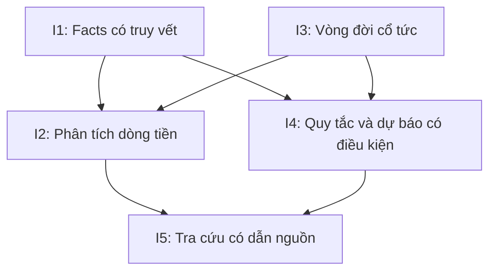

# So sánh và lựa chọn hướng phát triển

Ngày: 03/10/2026. Đây là đề xuất dựa trên phạm vi hiện hành và bằng chứng tại [khảo sát nguồn](03-khao-sat-nguon-thuc-te.md).

## 1. Định vị đóng góp

Điểm mạnh khả thi của đề tài là biến công bố phân tán thành một dataset kiểm tra được, sau đó nghiên cứu liên hệ giữa dòng tiền và cổ tức. Một dashboard chỉ vẽ các tỷ số có ít đóng góp nếu thiếu kiểm chứng dữ liệu và phương pháp. Ngược lại, dữ liệu tốt cùng kết quả quan hệ yếu vẫn trả lời được câu hỏi nghiên cứu một cách có giá trị.

Không tuyên bố đề tài là nghiên cứu đầu tiên ở Việt Nam: lượt tìm hiểu này chưa phải rà soát có hệ thống toàn bộ nghiên cứu trong nước.

## 2. Năm hướng có hồ sơ riêng

| Hướng | Đóng góp có thể bảo vệ | Bằng chứng cần có | Ưu tiên/phạm vi |
|---|---|---|---|
| I1. Thu thập và trích xuất BCTC có truy vết | Đo mức đúng, độ phủ, chi phí review và khả năng chạy lại | Bộ đối chiếu, raw/hash, benchmark parser | P0, lõi MVP/RQ1 |
| I2. Phân tích dòng tiền–cổ tức | Đo quan hệ và giải thích ngoại lệ theo ngành/năm | Firm-year đủ nguồn, thống kê và ít nhất 3 case | P0, lõi MVP/RQ2 |
| I3. Chuẩn hóa vòng đời sự kiện cổ tức | Giảm đếm trùng, sai kỳ và nhầm lịch với thực trả | Chuỗi thông báo gốc, phép đối chiếu và nhãn chất lượng | P0, lõi MVP; phân tích hoãn lịch là mở rộng |
| I4. Cảnh báo sớm có giải thích | So sánh quy tắc, lịch sử và logistic trên cùng mẫu | Ngày khả dụng, nhãn khép cửa sổ, split theo lịch | Quy tắc P0; ML P1 có gate/RQ3 |
| I5. Trợ lý tra cứu có dẫn nguồn | Đo câu trả lời đúng số, đúng nguồn và biết từ chối | Bộ câu hỏi có gold evidence, log retrieval | P2, sau MVP |

Độ khó chính của I1/I3 là dữ liệu; I2 là diễn giải và thiên lệch mẫu; I4 là nhãn theo thời điểm; I5 là giữ đúng căn cứ khi sinh văn bản. Các nhận định này là đánh giá thiết kế, chưa phải số đo công sức.

## 3. Phương án đề tài nên chọn

**Phương án A, khuyến nghị:** I1 + I3 + I2 + phần quy tắc của I4. Giữ tên đề tài trong SRS: “Hệ thống thu thập, chuẩn hóa và phân tích dữ liệu BCTC–cổ tức tiền mặt Việt Nam để đánh giá khả năng duy trì cổ tức và nghiên cứu cảnh báo sớm rủi ro cắt giảm”. Xem [bản chốt ý tưởng](../research-options/01-chot-y-tuong-de-tai.md). Báo cáo riêng RQ3 nếu nhãn dự báo chưa đủ.

**Phương án B, khi dữ liệu đủ:** thêm logistic và đánh giá xác suất của I4. Đóng góp bổ sung là kiểm tra giá trị ngoài mẫu của tín hiệu BCTC, không cam kết mô hình vượt baseline.

**Phương án C, sau MVP:** thêm I5 để tra cứu bằng ngôn ngữ tự nhiên. Tìm kiếm có nguồn là baseline; chỉ thêm LLM khi đo được lợi ích so với giao diện tra cứu.

Các phương án là cách ghép năm ý tưởng, không phải năm dự án phải thực hiện đồng thời.

## 4. Phụ thuộc và mốc quyết định

1. Tuần 1–2: xác minh 10 doanh nghiệp và đường tải; chưa tăng mô hình khi raw còn thiếu.
2. Tuần 3–4: đo parser và review; chốt có cần OCR theo tỷ lệ scan.
3. Tuần 5–6: chốt đích “được công bố” hay “thực trả” theo bằng chứng của I3.
4. Tuần 7–8: chốt snapshot và quy mô; chỉ tăng 60–80 khi đo được giờ xử lý.
5. Tuần 9–10: làm I2, quy tắc I4; kiểm tra gate ML trong đề cương.
6. Tuần 11–13: hoàn thiện API, báo cáo và tái lập; I5 có kế hoạch riêng sau MVP.

Không cộng thêm quỹ giờ của năm hướng vào lịch 13 tuần. I1/I2/I3 và rule score chia sẻ pipeline, dataset và thời gian hiện hành. Mọi tính năng thêm phải được đổi bằng phần khác hoặc đưa sang giai đoạn sau.

## 5. Khả năng mở rộng về sau

Có thể bổ sung CapEx, nợ vay, kỳ hạn nợ và lợi nhuận công ty mẹ để phân tích tiền còn lại sau đầu tư; thêm năm/ngành sau kiểm tra tính tương thích; hỗ trợ OCR khi benchmark chứng minh lợi ích. Giá cổ phiếu và nghiên cứu phản ứng thị trường cần một thiết kế dữ liệu khác, nên chưa đưa vào bộ năm ý tưởng này.

## 6. Bộ kết quả tối thiểu cần nộp

Dataset và data dictionary; manifest nguồn/phiên bản; báo cáo benchmark parser trước/sau review; báo cáo vòng đời cổ tức; kết quả phân tích và ba case; rule score có lý do và độ đầy đủ; dashboard/API; hướng dẫn tái lập. Nếu có ML hoặc RAG, nộp thêm protocol, baseline, kết quả đánh giá và lỗi còn lại tương ứng.
