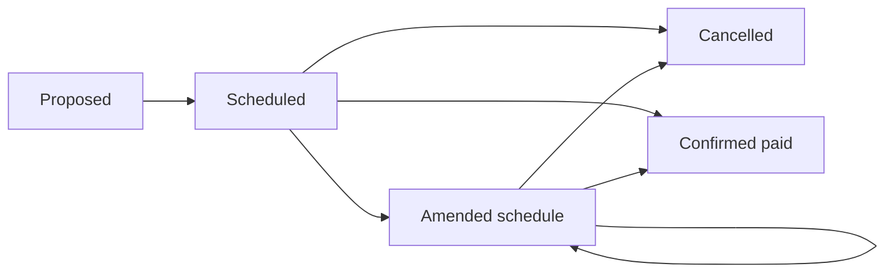

# I3 — Kỹ thuật IT: event registry và truy vấn theo thời điểm

Ngày: 03/10/2026. Mô hình bổ sung đề xuất cho SDD.

## 1. Tách thông báo khỏi sự kiện

| Thực thể | Vai trò |
|---|---|
| `dividend_notice` | Một tài liệu/bài công bố, có thời điểm và hash/locator |
| `dividend_event` | Quyền/đợt kinh tế ổn định, định danh nội bộ |
| `dividend_event_version` | Trạng thái, DPS và lịch có hiệu lực theo thông tin công bố |
| `dividend_component` | Phân bổ DPS cho profit_year/loại đợt |
| `event_notice_link` | Nguồn initial/amendment/cancellation/payment evidence |
| `source_coverage_window` | Công ty, nguồn, khoảng đã rà và mức đầy đủ |

Thông báo gộp nhiều lịch hoặc nhiều quyền có thể liên kết nhiều event. Một event có nhiều notice. Không khóa event chỉ bằng ticker+scheduled_date vì ngày có thể đổi.

## 2. Ghép sự kiện và xử lý xung đột

Ưu tiên tham chiếu văn bản/số thông báo trước; tiếp đến company, loại quyền, record_date, đợt và components. DPS/ngày gần nhau chỉ tạo candidate, không tự merge. Giữ conflict queue khi khác thông tin.

Sau merge không xóa raw/notice cũ. Duplicate cùng nội dung không tạo thêm DPS; amendment tạo version mới của event. Một thông báo có tổng và thành phần không tạo ba event độc lập để cộng.

## 3. Thời gian hai lớp

Lưu thời điểm công khai `available_at` và thời điểm hệ thống ghi nhận `recorded_at`. Phiên bản hồi cứu được biết ở hôm nay vẫn có thể có thời điểm công khai trước đây, nhưng chỉ khi nguồn đó xác minh được.

Truy vấn “biết gì tại cutoff” lấy version có `available_at <= cutoff`, sau đó chọn mới nhất trong các version đó. Không lấy lịch cuối cùng tại snapshot làm lịch đã biết năm trước. Chưa rõ available_at thì chặn mẫu theo thời điểm.

## 4. Chuyển trạng thái có bằng chứng

Sơ đồ là luồng điển hình, nguồn có thể thiếu các bước đầu. Mọi chuyển sang paid cần claim/evidence cụ thể; đồng hồ đi qua ngày lịch không kích hoạt chuyển trạng thái. Không ép thông báo lần đầu quan sát phải có proposed trước đó.

Nếu có trả từng phần, lưu amount/date/evidence của từng tranche; không chuyển toàn event thành paid chỉ từ một tranche. Nhánh này có thể để review thủ công trong MVP.

## 5. Ghép BCTC và sinh dữ liệu

Sinh hai view: DPS theo profit_year và DPS cửa sổ lịch/announcement/paid. Mỗi view có selection_policy, event_version_ids và component_ids. Hướng ghép theo thời gian có thể dùng [pandas merge_asof](https://pandas.pydata.org/docs/reference/api/pandas.merge_asof.html), nhưng phải lọc company/scope/basis/loại trước và xác minh thứ tự; ghép gần nhất không giải quyết ngữ nghĩa sự kiện.

Coverage ledger lưu nguồn đã rà, khoảng truy vấn, lần chạy, lỗi, reviewer và bằng chứng. “Không thấy event trong một query” không đủ coverage complete.

## 6. API và kiểm thử

API timeline hiển thị sự kiện tổng, components, các lịch cũ/mới và nguồn, có cutoff_as_of. Kiểm thử amendment không tăng tổng DPS; components bằng tổng; version sau cutoff bị loại; nguồn thiếu giữ unknown; đổi sớm không thành delayed; thông báo cổ phiếu không thành cash.

Ngôn ngữ/kỹ năng cần học: SQL versioned records, date/timezone, dedupe/entity resolution, finite-state logic, idempotent batch. Không cần hệ thống streaming hay event sourcing toàn ứng dụng; chỉ cần lưu lịch sử nghiệp vụ cần tái lập.
