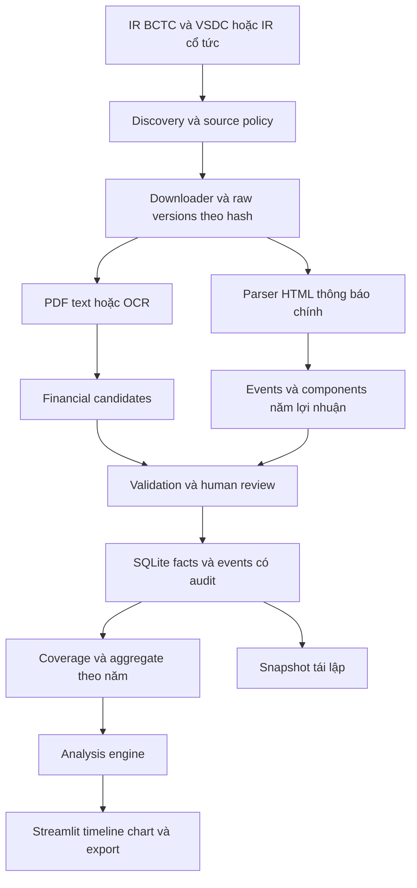

# Kiến trúc và mô hình dữ liệu

## Bổ sung kiến trúc cầu nối CFO theo SRS v3.1

Luồng thêm: report text/OCR hoặc nhập dòng có nguồn → bridge_mapper → review → bridge_validator → case_composer → UI/snapshot. Phân tách bridge_compare cho cặp năm được chọn; dùng chung Python/SQLite/Streamlit, không tạo hệ thống độc lập. Chi tiết trường/ràng buộc tại [thiết kế cầu nối](../research-profit-cash-dividend/05-thiet-ke-va-workflow.md).

Thêm bridge_definitions (method/start/mapping version), bridge_lines (report version/kỳ/scope/raw label/code/value/role/group/parent/locator/review), bridge_results (snapshot/start/CFO/observed sum/residual/tolerance/completeness/status), bridge_operands (unique result+leaf), analysis_cases và case_evidence. Duyệt và audit cùng transaction. Leaf được cộng đúng một lần; subtotal chỉ đối chiếu. Snapshot lưu dòng đã duyệt và phiên bản formula/mapping, không replay bằng mapping live. Chưa có module nào được xác nhận đã triển khai.

Thiết kế nền ngày 03/10/2026, cập nhật cầu nối ngày 05/10/2026 cho lợi nhuận–dòng tiền–cổ tức tiền mặt. Chưa là mô tả toàn bộ app đã triển khai.

## 1 Stack và luồng

Python 3.12, HTTP/lxml, pdfplumber/pypdf, render và Tesseract vie/eng, sqlite3, pandas, Streamlit. Một backend Python; chưa cần React/PostgreSQL/FastAPI. Crawler nghiên cứu đã dùng lxml/pypdf, chưa là collector hoàn chỉnh cho mọi kỳ/sự kiện.

Module đề xuất: collect, extract, normalize, validate, store, events, analysis, ui. Chỉ tạo khi viết code thật, không coi thư mục trống là module xong. UI gọi engine độc lập, không tự tính tổng trực tiếp từ raw candidates.

## 2 Schema đề xuất

| Bảng | Vai trò |
|---|---|
| issuers/securities | Pháp nhân, ticker/ISIN/share class, effective mapping, ngành |
| source_checks | Discovery route, URL/host policy, checked_at, HTTP/headers/errors |
| blobs/document_versions | Raw hash/path, nguồn, version, period/scope/assurance/unit |
| extraction_runs | Parser/model/config, thời gian, errors |
| fact_candidates/reviewed_facts | Sáu trường, raw/normalized, period, unit, scope, page/bbox |
| notices/notice_versions | Canonical notice ID, source/hash, main-body version |
| dividend_events | Issuer/security, loại, dates, lifecycle, source references |
| event_components | Profit year, installment, raw/normalized DPS, share basis |
| event_relations | Supersedes/cancels/dedup cross-source đã review |
| corporate_actions | Loại, ngày hiệu lực, adjustment evidence/status |
| reviews | Before/after/reason/reviewer, liên kết phiên bản |
| coverage_ledger | Issuer–year–scope/source, khoảng rà, completeness/evidence |
| annual_dividend_aggregates | Observed DPS, annual DPS nếu đủ, operands, coverage/basis |
| derived_metrics/snapshots | Formula/operand IDs, config/cutoff, document/fact/event versions |

Canonical notice không đồng nhất URL; hash toàn HTML không đồng nhất event. Một event nhiều components; một event nhiều source references. Aggregate không dựa khóa ticker/year đơn lẻ, còn scope/series/security/basis/snapshot. Phiên bản raw khác logical document khác numerical fact.

## 3 Constraints và giao dịch

Foreign keys bật trong SQLite. Unique blob hash, source URL check theo run, candidate/fact identity theo document version/metric/period/column/scope. Canonical notice ID theo provider; cross-source duplicate cần relation review. Không UNIQUE ticker/date/DPS rồi vô tình mất hai đợt hợp lệ.

Sửa fact/event và audit trong một transaction; rollback không để số mới thiếu lịch sử. Aggregate/snapshot dùng active reviewed versions tại cutoff; amendment không phá snapshot cũ. Timestamp retrieval khác publication. Timezone nguồn không ghi giữ unknown, không tự áp timezone hệ thống.

## 4 API nội bộ và phép tính

Collector trả raw/provenance; extractor trả candidate; validator trả issues; reviewer tạo reviewed version. Event resolver trả active components, basis và coverage. Engine nhận reviewed operands, trả value/formula/operand IDs/missing reason.

Sáu metric codes và ratio: CFO/LNST khi LNST>0; tiền/tài sản và nợ phải trả/tài sản khi assets>0. DPS growth chỉ với annual đủ/basis tương thích và nền>0. Không CFO/DPS vì khác đơn vị. EPS/payout mở rộng cần đủ dữ liệu và định nghĩa, không phải nghĩa vụ lõi.

## 5 Tái sử dụng và vận hành

[crawl_official_reports.py](../../scripts/research/crawl_official_reports.py) có discovery/phân trang, conditional GET, hash và pilot robots; hiện fixed FY2025/H1-2026 và JSON history đơn tiến trình. Cần period config, adapter cổ tức, SQLite/recovery và tests mới khi triển khai. [Extractor sự kiện cũ](../../scripts/research/extract_recent_dividend_examples.py) minh họa bốn seed mẫu, không đủ chứng minh discovery full history.

File upload/tải có cap, loại/magic check, đường lưu theo hash và không thực thi nội dung. Log không có credentials. Chỉ nguồn có policy rõ cho collector định kỳ; unknown pending. Raw Git-ignore; export manifest/config và cách dựng lại phù hợp.

[Phương pháp](11-phuong-phap-thu-thap-va-xu-ly.md) và [ghép sự kiện](13-ghep-co-tuc-va-phan-tich.md) là contract nghiệp vụ của schema.
