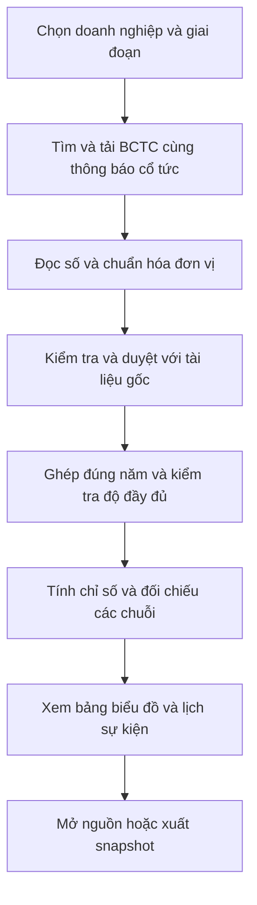

# Giải thích chức năng và dữ liệu của đề tài

Ngày cập nhật: **04/10/2026**.

**Đề tài:** Xây dựng hệ thống thu thập, chuẩn hóa và phân tích dữ liệu lợi nhuận, dòng tiền kinh doanh và cổ tức tiền mặt của doanh nghiệp niêm yết Việt Nam.

Tài liệu này giúp người đọc hiểu hệ thống phục vụ ai, làm những việc cụ thể nào, cần lấy những dữ liệu nào và giải quyết vấn đề gì. Đây là mô tả sản phẩm cần xây dựng theo SRS hiện hành; chưa phải xác nhận tất cả chức năng đã hoàn thành.

Nếu cần hiểu ý nghĩa tài chính của các con số trước, đọc [nhập môn tài chính cho dự án](18-nhap-mon-tai-chinh-cho-du-an.md): giải thích bằng ví dụ cửa hàng và phân biệt lợi nhuận, dòng tiền, số dư tiền, cổ tức cùng các tỷ số.

## 1 Hiểu ý tưởng trước khi đọc chức năng

Người theo dõi doanh nghiệp thường cần kiểm tra ba câu hỏi liên quan nhau:

1. Doanh nghiệp có lãi bao nhiêu và lợi nhuận thay đổi thế nào qua các năm?
2. Dòng tiền từ hoạt động kinh doanh có tăng cùng lợi nhuận không, hay lợi nhuận tăng nhưng dòng tiền giảm/âm?
3. Trong bối cảnh đó, mức cổ tức tiền mặt doanh nghiệp công bố cho mỗi năm lợi nhuận tăng, giữ nguyên hay giảm?

Muốn trả lời, người dùng phải đọc nhiều báo cáo và thông báo. Hệ thống gom chúng lại, lấy đúng số, kiểm tra rồi trình bày bảng/biểu đồ có thể mở nguồn để đối chiếu. Kết quả giúp chọn những trường hợp cần tìm hiểu sâu hơn.

**Người dùng chính:** cá nhân theo dõi doanh nghiệp phi tài chính, có kiến thức tài chính cơ bản. Sinh viên/người nghiên cứu có thể xuất dữ liệu để viết báo cáo. Người vận hành kiểm tra kết quả máy đọc và sửa lỗi trước khi công bố.

Ba khái niệm xuất hiện nhiều trong tài liệu:

| Khái niệm | Hiểu đơn giản | Đơn vị trong hệ thống |
|---|---|---|
| Lợi nhuận sau thuế, viết tắt LNST | Kết quả lãi/lỗ sau thuế ghi trong báo cáo của kỳ | Đồng; giao diện có thể đổi sang tỷ đồng để dễ đọc |
| Dòng tiền kinh doanh, viết tắt CFO | Số tiền thuần từ hoạt động kinh doanh ghi trong báo cáo lưu chuyển tiền tệ; có thể dương hoặc âm | Đồng |
| Cổ tức tiền mặt mỗi cổ phiếu, viết tắt DPS | Mức tiền mặt công bố cho một cổ phiếu đủ điều kiện nhận quyền | Đồng/cổ phiếu |

LNST là số theo kế toán; CFO là dòng tiền của hoạt động kinh doanh trong kỳ; số dư tiền là tiền và tương đương tiền tại một ngày. Ba đại lượng này có ý nghĩa khác nhau. DPS lại tính trên **một cổ phiếu**, nên phải trình bày với đơn vị riêng.

## 2 Một câu chuyện để hình dung cách sử dụng

Minh thấy tin doanh nghiệp X tăng lợi nhuận và công bố cổ tức. Minh muốn kiểm tra lịch sử ba năm trước khi quyết định đọc sâu X. Nếu làm thủ công, Minh phải tải BCTC, nhập số, tìm từng thông báo cổ tức và rà các bản sửa.

Trong hệ thống dự kiến, Minh chọn X và giai đoạn 2023–2025. Hệ thống cho biết năm nào đã có BCTC được kiểm tra, năm nào chưa rà đủ cổ tức. Minh xem lợi nhuận và CFO, xem cổ tức theo năm lợi nhuận, rồi bấm vào một con số để mở đúng tài liệu gốc. Minh xuất bản dữ liệu đang xem để lưu cùng báo cáo của mình.

Khi có dữ liệu thiếu, Minh thấy rõ điều gì chưa thể kết luận. Câu chuyện này là tình huống thiết kế, chưa phải kết quả khảo sát người dùng.

## 3 Sử dụng những dữ liệu cụ thể nào

### 3.1 Chọn doanh nghiệp và giai đoạn

Giai đoạn chính là **2023, 2024 và 2025**, ưu tiên doanh nghiệp phi tài chính và BCTC năm đã kiểm toán. Bắt đầu với **3 doanh nghiệp × 3 năm = 9 BCTC năm**, tương ứng **54 ô chỉ tiêu tài chính cần kiểm tra** nếu mỗi báo cáo có đủ sáu trường. Đây là mục tiêu thu thập, chưa phải 54 số đã có.

VNM và DHG là ứng viên pilot vì hồ sơ dự án đã có thông báo cổ tức mẫu. Doanh nghiệp thứ ba chỉ chốt sau khi kiểm tra nguồn, phạm vi báo cáo và lịch sử cổ tức. Mở rộng lên 5–8 doanh nghiệp khi công sức thu thập/kiểm tra cho phép; không lấy một mẫu nhỏ làm kết luận cho toàn thị trường.

| Nhóm dữ liệu | Cụ thể cần gì | Lấy từ đâu |
|---|---|---|
| Nhận diện doanh nghiệp | Tên pháp nhân, mã chứng khoán, mã định danh nội bộ; ISIN (mã định danh chứng khoán quốc tế) nếu có; ngành | Thông tin trên trang quan hệ cổ đông và tài liệu/thông báo chính thức |
| BCTC năm | Bộ báo cáo năm, năm tài chính thật, phạm vi báo cáo và xác nhận loại kiểm toán | Trang quan hệ cổ đông của doanh nghiệp; các danh mục đã thử trong hồ sơ gồm DHG, HPG, VHC |
| Cổ tức tiền mặt | Thông báo quyền, từng đợt, năm lợi nhuận, số tiền/cổ phiếu và các mốc ngày | Thông báo VSDC; trang quan hệ cổ đông và nghị quyết/thông báo doanh nghiệp để đối chiếu |
| Điều chỉnh/hủy | Nội dung sửa lịch, sửa mức tiền, hủy hoặc thay thông báo trước | Công bố điều chỉnh/hủy từ VSDC hoặc doanh nghiệp |
| Thay đổi cơ sở cổ phiếu | Loại sự kiện, ngày hiệu lực, bằng chứng thay đổi cơ sở tính DPS | Công bố liên quan chia/tách cổ phiếu, cổ tức cổ phiếu, cổ phiếu thưởng hoặc phát hành; cần kiểm tra tác động cụ thể |
| Bằng chứng nguồn | File/HTML gốc, URL, ngày công bố, ngày tải, phiên bản và vị trí dòng số | Lưu cùng mỗi lần lấy dữ liệu |

Danh mục nguồn và bằng chứng đã thử nằm ở [sổ nguồn của dự án](10-so-nguon.md). Việc từng tải được một tài liệu của HPG/DHG/VHC không đồng nghĩa đã chọn xong các công ty đó cho toàn bộ mẫu.

### 3.2 Sáu số tài chính bắt buộc

Một bộ BCTC chứa nhiều bảng. Đề tài lấy **sáu số dưới đây**, không chỉ ghi chung chung “dữ liệu báo cáo tài chính”. Tên dòng có thể thay đổi nhẹ giữa các mẫu báo cáo; phải xác nhận đúng ý nghĩa và cột năm.

| Dữ liệu | Dòng cần tìm và bảng nguồn | Kỳ lấy số | Dùng để làm gì |
|---|---|---|---|
| LNST tổng | Dòng “Lợi nhuận sau thuế thu nhập doanh nghiệp” trong báo cáo kết quả hoạt động kinh doanh | Cả năm tài chính | Xem mức/chênh lệch lợi nhuận; tính CFO/LNST; đối chiếu với DPS |
| CFO | Dòng “Lưu chuyển tiền thuần từ hoạt động kinh doanh” trong báo cáo lưu chuyển tiền tệ | Cùng cả năm với LNST | Xem biến động dòng tiền; tính CFO/LNST; tìm năm lợi nhuận và CFO khác chiều |
| Tiền và tương đương tiền | Dòng “Tiền và các khoản tương đương tiền” trong bảng cân đối kế toán | Tại ngày cuối năm tài chính | Xem số dư tiền và tính tiền/tổng tài sản |
| Tổng tài sản | Dòng “Tổng cộng tài sản” trong bảng cân đối kế toán | Cùng ngày cuối năm | Làm mẫu số cho tỷ lệ tiền và tỷ lệ nợ phải trả; kiểm tra cân đối |
| Tổng nợ phải trả | Dòng “Nợ phải trả”, lấy tổng mục, trong bảng cân đối kế toán | Cùng ngày cuối năm | Tính nợ phải trả/tổng tài sản; kiểm tra cân đối |
| Tổng vốn chủ sở hữu, viết tắt VCSH | Dòng “Vốn chủ sở hữu”, lấy tổng mục, trong bảng cân đối kế toán | Cùng ngày cuối năm | Hiển thị trong bảng dữ liệu; kiểm tra tài sản xấp xỉ nợ phải trả + VCSH theo độ làm tròn của nguồn |

**Điểm cần đọc đúng:** LNST tổng không thay bằng riêng LNST của cổ đông công ty mẹ khi tính với CFO tổng. Nợ phải trả gồm nhiều nghĩa vụ, không đồng nghĩa toàn bộ là nợ vay. VCSH là phần bắt buộc để hiển thị/kiểm tra dữ liệu; chưa đưa thêm ROE vào chức năng lõi.

### 3.3 Mỗi số phải đi kèm thông tin gì

Một con số như “120.000” chưa đủ để phân tích. Hệ thống phải biết nó là số gì, thuộc công ty/năm nào và được ghi theo đơn vị nào.

| Thông tin kèm theo | Ví dụ giả định | Tác dụng |
|---|---|---|
| Doanh nghiệp và tên chỉ tiêu | X; LNST tổng | Không lẫn công ty hoặc nhầm chỉ tiêu |
| Kỳ bắt đầu/kết thúc hoặc ngày chốt số | 01/01/2024–31/12/2024 với LNST/CFO; 31/12/2024 với tài sản/tiền | Không lấy số quý hoặc đầu năm thay cho số năm/cuối năm |
| Phạm vi BCTC | Hợp nhất | Đảm bảo các số dùng chung phạm vi |
| Giá trị và đơn vị gốc | 120.000; triệu đồng | Giữ bằng chứng trước khi quy đổi |
| Giá trị chuẩn hóa | 120.000.000.000 đồng | Dùng thống nhất trong phép tính |
| File và vị trí | BCTC X năm 2024; trang 5, dòng LNST, cột năm 2024 | Mở đúng chỗ để kiểm chứng |
| Phiên bản và trạng thái kiểm tra | Bản tải tại một mốc; đã duyệt | Không dùng số chưa kiểm tra hoặc ghi đè mất bản cũ |

**BCTC hợp nhất** phản ánh nhóm công ty; **BCTC riêng** phản ánh một pháp nhân. Hệ thống duy trì chuỗi năm cùng phạm vi; không ghép CFO hợp nhất với LNST riêng. Nếu doanh nghiệp không lập hợp nhất và đã xác nhận, dùng báo cáo cấp doanh nghiệp với nhãn rõ ràng.

### 3.4 Các trường cụ thể của thông báo cổ tức

| Trường cần lấy | Ý nghĩa | Vì sao cần |
|---|---|---|
| Doanh nghiệp, mã chứng khoán/ISIN | Ai công bố, cổ phiếu nào nhận quyền | Ghép đúng công ty/chứng khoán |
| Mã thông báo và loại sự kiện | Cổ tức tiền mặt, cổ tức cổ phiếu, điều chỉnh hoặc hủy | Phân biệt loại, nhận diện cùng một thông báo |
| Số tiền trên mỗi cổ phiếu | Ví dụ giả định 1.000 đồng/cổ phiếu | Là số DPS đưa vào phân tích |
| Tỷ lệ và mệnh giá nếu nguồn ghi theo % | Ví dụ giả định 10% trên mệnh giá 10.000 đồng | Quy đổi 0,10 × 10.000 = 1.000 đồng/cổ phiếu; không hiểu là lợi suất theo giá thị trường |
| Năm lợi nhuận | Ví dụ cổ tức thuộc năm 2024 | Ghép với BCTC 2024 dù thông báo đăng năm 2025 |
| Đợt/tạm ứng/phần còn lại | Ví dụ đợt 1 hoặc thanh toán còn lại | Theo dõi nhiều đợt, kiểm tra còn thiếu đợt nào |
| Ngày công bố | Khi thông báo xuất hiện theo nguồn | Lập lịch sử công bố; khác ngày hệ thống tải |
| Ngày đăng ký cuối cùng | Mốc chốt danh sách người nhận quyền | Hiển thị lịch sự kiện đúng nội dung nguồn |
| Ngày thanh toán theo lịch | Mốc doanh nghiệp thông báo sẽ trả | Hiển thị lịch, chưa chứng minh thực trả |
| Quan hệ với thông báo trước | Sửa lịch, sửa tiền, thay thế hoặc hủy thông báo nào | Chọn bản có hiệu lực và tránh cộng trùng |
| Cơ sở cổ phiếu | Mức tiền tính cho cổ phiếu trước/sau thay đổi nào | Kiểm tra có thể cộng/so sánh DPS hay chưa |
| Nguồn, vị trí nội dung, phiên bản và trạng thái duyệt | URL, đoạn thông báo, ngày lấy, đã kiểm tra hay đang chờ | Kiểm chứng và lưu lịch sử |

Số lượng thông báo không cố định là một thông báo/công ty/năm: một năm có thể có nhiều đợt, một thông báo có thể gộp nhiều năm và có thêm bản sửa. Hệ thống phải rà các đợt liên quan năm lợi nhuận, kể cả công bố ở năm sau.

**Xác nhận đã thực trả** chỉ thêm khi có bằng chứng riêng. Việc ngày thanh toán đã qua không đủ để đổi trạng thái thành “đã trả”. Nghị quyết phê duyệt và thông báo quyền của cùng đợt là các tài liệu đối chiếu, không cộng hai lần như hai khoản cổ tức.

### 3.5 Dữ liệu về độ đầy đủ và lịch sử

Hệ thống lưu công ty–năm–phạm vi cần tìm, nguồn/trang/khoảng ngày đã rà, số đã kiểm tra, phần thiếu, người xác nhận và thời điểm chốt dữ liệu. Trạng thái riêng cho BCTC và cổ tức gồm **đủ tại mốc kiểm tra**, **mới có một phần**, **chưa xác định**.

Ví dụ: đã có sáu số BCTC 2025 nhưng mới tìm được một đợt cổ tức 2025. Khi đó BCTC có thể đủ, cổ tức vẫn chưa đủ. Có số chưa có nghĩa đã có toàn bộ lịch sử năm đó.

## 4 Các chức năng cụ thể của hệ thống

### 4.1 Chọn doanh nghiệp và xem dữ liệu đã có

**Người dùng làm gì:** chọn doanh nghiệp và các năm muốn đọc.

**Dữ liệu dùng:** mã/tên doanh nghiệp, giai đoạn, danh sách BCTC, sáu số đã duyệt, các đợt cổ tức và trạng thái đầy đủ.

**Hệ thống thực hiện:** hiển thị bảng theo năm, phạm vi báo cáo, chỉ tiêu có/thiếu, trạng thái cổ tức và lý do còn thiếu. Người dùng thấy ngay năm nào đủ điều kiện phân tích.

**Vấn đề giải quyết:** tránh phân tích một bảng có lỗ hổng mà không biết, hoặc nhầm “chưa tìm thấy” thành số 0.

### 4.2 Tự tìm và tải tài liệu từ nguồn chính thức

**Dữ liệu dùng:** danh sách doanh nghiệp, địa chỉ danh mục BCTC/trang tìm thông báo, mã chứng khoán và năm cần tìm.

**Hệ thống thực hiện:** đọc danh mục, tìm tài liệu phù hợp, tải PDF/HTML, lưu địa chỉ nguồn và ngày lấy. Tách báo cáo năm với quý/bán niên; khi chạy lại thì kiểm tra nội dung có đổi không và giữ các phiên bản cần thiết.

**Đầu ra:** tài liệu gốc kèm danh sách tìm thấy, chưa tìm thấy hoặc tải lỗi. Nếu nhập tay một URL/file để bổ sung, phải ghi đó là nhập hỗ trợ.

**Vấn đề giải quyết:** giảm thao tác tìm/tải từng file; tránh bỏ mất dấu vết nguồn. Thời gian tiết kiệm phải đo cả phần kiểm tra tay, chưa mặc định hệ thống tự động hoàn toàn.

### 4.3 Đọc sáu số tài chính và nội dung cổ tức

**Dữ liệu dùng:** PDF BCTC và nội dung chính của thông báo cổ tức.

**Hệ thống thực hiện:** lấy các dòng ở mục 3.2 và trường ở mục 3.4. PDF có chữ thì đọc trực tiếp; PDF dạng ảnh thì nhận dạng chữ/số bằng OCR. Đổi nghìn/triệu đồng về đồng, giữ dấu âm và gắn đúng năm/phạm vi. Các số máy đọc được vẫn chờ kiểm tra.

**Đầu ra:** bảng số trích được, giá trị/đơn vị gốc, giá trị chuẩn hóa, vị trí nguồn và các chỗ chưa đọc chắc chắn.

**Vấn đề giải quyết:** giảm nhập số lặp lại và xử lý khác biệt định dạng. Ví dụ “120.000 triệu đồng” phải thành 120 tỷ đồng, không thành 120.000 đồng.

### 4.4 Kiểm tra và duyệt dữ liệu trước khi phân tích

**Dữ liệu dùng:** số máy đọc, ảnh/trang/đoạn gốc, kỳ, đơn vị, phạm vi và quan hệ giữa các thông báo.

**Hệ thống thực hiện:** kiểm tra đúng cột năm, đúng phạm vi, thiếu chỉ tiêu, số âm, đơn vị và cân đối tài sản–nợ–VCSH. Với cổ tức, kiểm tra mã, năm lợi nhuận, các đợt, trùng/sửa/hủy. Người vận hành đối chiếu nguồn, xác nhận hoặc sửa; lưu số trước/sau và lý do.

**Đầu ra:** dữ liệu đã duyệt để phân tích và danh sách chưa đủ điều kiện. Cân đối khớp là một phép kiểm tra, chưa tự chứng minh mọi số đã đúng.

**Vấn đề giải quyết:** ngăn lỗi máy đọc hoặc lỗi ghép trở thành kết quả có vẻ chính xác trên biểu đồ; có lịch sử để kiểm tra người đã sửa gì.

### 4.5 Ghép cổ tức với đúng năm lợi nhuận và tính tổng

**Dữ liệu dùng:** doanh nghiệp, năm lợi nhuận, DPS từng đợt, loại sự kiện, quan hệ sửa/hủy/trùng, cơ sở cổ phiếu và độ đầy đủ.

**Hệ thống thực hiện:** tách một thông báo gộp nhiều năm thành các phần thuộc đúng năm; một đợt ở nhiều nguồn chỉ cộng một lần sau xác nhận; sửa mức tiền thay số cũ, sửa lịch giữ số tiền. Với hủy, xác định đúng đối tượng bị hủy: hủy ngày đăng ký/thông báo thực hiện quyền không đồng nghĩa không chia cổ tức cả năm; rà bản thay thế và giữ trạng thái chưa đủ nếu chưa rõ. Khi cơ sở cổ phiếu chưa tương thích, chưa cộng thành tổng năm.

**Đầu ra:** từng đợt cùng nguồn; **tổng phần đã quan sát**; **tổng năm đã rà đủ tại mốc dữ liệu** nếu đủ điều kiện; chênh lệch/% giữa hai năm khi so sánh hợp lệ.

**Vấn đề giải quyết:** tránh cổ tức năm 2024 bị đưa vào 2025 chỉ vì đăng thông báo năm 2025; tránh tổng phình lên do đăng trùng/bản sửa; tránh coi lịch sử thiếu là không chia cổ tức.

**Ví dụ đã lưu trong hồ sơ khảo sát:** thông báo VNM 187729 có tổng 2.850 đồng/cổ phiếu, gồm 350 đồng thuộc năm lợi nhuận 2024 và 2.500 đồng thuộc 2025. Hệ thống phải tách đúng hai phần. Đây là nội dung một thông báo trong [bộ ví dụ cổ tức đã lưu](../research-recent-data/dividend-event-examples.json), chưa phải tổng cổ tức đầy đủ của hai năm hay xác nhận đã trả.

### 4.6 Phân tích lợi nhuận và dòng tiền kinh doanh

**Dữ liệu dùng:** LNST tổng và CFO của từng năm, cùng phạm vi và đơn vị, đã duyệt.

**Hệ thống thực hiện và đầu ra:**

| Câu hỏi cụ thể | Phép xử lý | Kết quả người dùng nhận |
|---|---|---|
| LNST và CFO từng năm là bao nhiêu? | Sắp chuỗi theo năm | Bảng và hai đường cùng đơn vị |
| Năm sau khác năm trước bao nhiêu? | Giá trị năm sau − năm trước | Chênh lệch bằng đồng/tỷ đồng, giữ đúng dấu |
| LNST tăng/giảm bao nhiêu %? | (LNST năm sau − LNST năm trước) / LNST năm trước × 100% | % khi năm trước >0; nếu <=0 thì ghi lý do không tính theo cách này |
| CFO bằng bao nhiêu lần LNST? | CFO / LNST tổng | Tỷ số khi LNST >0; CFO âm vẫn cho tỷ số âm; nếu LNST <=0 thì trả trạng thái riêng |
| Có năm nào LNST tăng nhưng CFO giảm? | So chênh lệch của hai biến trên cùng cặp năm | Danh sách các trường hợp kèm số và nguồn |

**Vấn đề giải quyết:** người dùng không chỉ nhìn một số lợi nhuận riêng lẻ; thấy được CFO thấp, giảm hoặc âm khi đối chiếu cùng kỳ. Kết quả chưa tự giải thích nguyên nhân khác biệt vì sáu trường lõi chưa có chi tiết khoản phải thu, tồn kho hoặc các điều chỉnh CFO.

### 4.7 Xem cơ cấu tiền và nợ phải trả

**Dữ liệu dùng:** tiền và tương đương tiền, tổng tài sản, tổng nợ phải trả và VCSH tại cùng ngày cuối năm, cùng phạm vi.

**Hệ thống thực hiện:** tính **tiền / tổng tài sản × 100%** và **nợ phải trả / tổng tài sản × 100%** khi tổng tài sản >0; hiển thị từng năm và mức thay đổi. VCSH dùng trong bảng và kiểm tra cân đối.

**Đầu ra:** ví dụ giả định tiền chiếm 9,09% tài sản, nợ phải trả chiếm 50% tài sản; mở được số đầu vào.

**Vấn đề giải quyết:** thêm bối cảnh về số dư tiền và cơ cấu nguồn vốn khi đọc lợi nhuận–CFO–cổ tức. Hai tỷ lệ này chưa chứng minh khả năng thanh toán tức thời hay số tiền pháp nhân mẹ có thể chia cổ tức; nợ phải trả không được đổi tên thành nợ vay.

### 4.8 Đối chiếu lợi nhuận dòng tiền và cổ tức

**Dữ liệu dùng:** bảng doanh nghiệp–năm với LNST, CFO, tỷ số hợp lệ và DPS năm đã đủ/so sánh được.

**Hệ thống thực hiện:** đặt các chuỗi theo cùng trục năm với đơn vị riêng; lọc các cặp năm như “LNST tăng, CFO giảm” hoặc “DPS giữ nguyên/tăng trong khi LNST hoặc CFO giảm”. Điều kiện có DPS phải kiểm tra đủ lịch sử và cơ sở cổ phiếu của cả hai năm.

**Đầu ra:** danh sách trường hợp, số liệu trước/sau, biểu đồ và nguồn; số quan sát dùng được/bị loại kèm lý do. Chọn ba trường hợp thật có bằng chứng để viết phân tích sâu.

Trên tập hợp lệ có thể thêm biểu đồ phân tán và hệ số tương quan thứ hạng Spearman, chẳng hạn giữa % thay đổi LNST và % thay đổi DPS. Biểu đồ cho thấy các cặp số; hệ số mô tả mức cùng chiều/ngược chiều theo thứ hạng. Nếu <3 cặp hoặc một biến không thay đổi thì chưa xuất hệ số. Kể cả có hệ số, mẫu nhỏ và quan sát lặp theo doanh nghiệp vẫn hạn chế cách diễn giải.

**Vấn đề giải quyết:** giúp tập hợp những trường hợp cần đọc sâu thay vì rà từng công ty bằng tay. Kết quả mô tả điều đã xảy ra; chưa kết luận CFO gây thay đổi cổ tức hoặc dự báo năm sau.

### 4.9 Xem lịch công bố và các thay đổi

**Dữ liệu dùng:** ngày công bố, ngày đăng ký cuối cùng, ngày thanh toán theo lịch, năm lợi nhuận và quan hệ sửa/hủy.

**Hệ thống thực hiện:** vẽ dòng thời gian; hiển thị nội dung hiện hành và bản trước. Người dùng thấy năm lợi nhuận ở bảng phân tích và ngày công bố/thanh toán ở lịch sự kiện, không đánh đồng hai loại mốc.

**Đầu ra:** thông báo nào đến trước/sau, lịch nào đã đổi, thông báo nào bị hủy và mức tiền đang có hiệu lực.

**Vấn đề giải quyết:** tránh đọc lịch cũ hoặc nhầm ngày thanh toán với năm tạo lợi nhuận; giữ riêng trạng thái xác nhận thực trả khi có bằng chứng.

### 4.10 Mở nguồn và xuất dữ liệu có thể kiểm tra lại

**Dữ liệu dùng:** số gốc, công thức, các đợt cấu thành DPS, nguồn/phiên bản, trạng thái đầy đủ và mốc dữ liệu.

**Hệ thống thực hiện:** khi bấm một số, mở các số đầu vào và đúng trang/đoạn nguồn. Khi xuất CSV/JSON, kèm tập dữ liệu đã chốt, điều kiện lọc, đơn vị/phạm vi, công thức và nguồn. Bản dữ liệu chốt tại một mốc gọi là **snapshot**; nguồn đổi sau đó không làm bản cũ đổi theo.

**Đầu ra:** dữ liệu để viết báo cáo và tái tính trên cùng đầu vào; lịch sử trước/sau khi tài liệu hoặc số được sửa. CSV là dạng bảng có thể mở bằng Excel; JSON là dạng dữ liệu có cấu trúc cho chương trình đọc lại.

**Vấn đề giải quyết:** người đọc biết một nhận xét dựa trên đâu; người khác có thể kiểm tra và làm lại thay vì chỉ nhìn ảnh biểu đồ.

## 5 Ví dụ xuyên suốt từ đầu vào tới kết quả

**Toàn bộ số của X dưới đây là giả định để giải thích chức năng.** Giả sử hai BCTC cùng phạm vi, số đã kiểm tra, cổ tức đã rà đủ và cơ sở cổ phiếu tương thích.

| Dữ liệu | 2023 | 2024 | Đơn vị |
|---|---|---|---|
| LNST tổng | 100 | 120 | Tỷ đồng |
| CFO | 90 | 40 | Tỷ đồng |
| Tiền và tương đương tiền | 120 | 100 | Tỷ đồng |
| Tổng tài sản | 1.000 | 1.100 | Tỷ đồng |
| Tổng nợ phải trả | 400 | 550 | Tỷ đồng |
| Tổng VCSH | 600 | 550 | Tỷ đồng |
| DPS công bố đủ | 1.000 | 1.500 | Đồng/cổ phiếu |

Hệ thống xử lý và trả lời cụ thể:

| Kết quả | Cách tính | Người dùng hiểu được gì |
|---|---|---|
| LNST 2024 tăng 20 tỷ, tương ứng 20% | 120 − 100; 20 / 100 × 100% | Lợi nhuận tăng |
| CFO 2024 giảm 50 tỷ | 40 − 90 = −50 | Dòng tiền kinh doanh giảm dù lợi nhuận tăng |
| CFO/LNST từ 0,90 xuống khoảng 0,33 lần | 90 / 100; 40 / 120 | CFO thấp hơn so với LNST theo tỷ số này |
| Tiền/tài sản từ 12% xuống khoảng 9,09% | 120 / 1.000; 100 / 1.100 | Tiền chiếm tỷ trọng thấp hơn trong tài sản |
| Nợ phải trả/tài sản từ 40% lên 50% | 400 / 1.000; 550 / 1.100 | Nợ phải trả chiếm tỷ trọng cao hơn |
| DPS tăng 500 đồng, tương ứng 50% | 1.500 − 1.000; 500 / 1.000 × 100% | Mức cổ tức tiền mặt công bố tăng trên cùng cơ sở cổ phiếu |

Nhận xét có thể xuất: **“Năm 2024, LNST và DPS công bố tăng, trong khi CFO giảm; CFO/LNST giảm từ 0,90 xuống khoảng 0,33 lần.”** Mỗi phần nhận xét gắn với số và nguồn tương ứng.

Nếu mới tìm được 1.500 đồng/cổ phiếu nhưng chưa rà đủ các đợt 2024, hệ thống chỉ gọi đó là **tổng phần đã quan sát**, chưa xuất nhận xét DPS năm tăng 50%. Nếu BCTC 2024 là phạm vi khác 2023, hệ thống chưa nối chuỗi như ví dụ.

Hệ thống không lấy 40 tỷ CFO chia cho 1.500 đồng/cổ phiếu để gọi là khả năng trang trải cổ tức: hai đại lượng có đơn vị và ý nghĩa khác nhau. Muốn nghiên cứu tổng tiền chi trả cần thêm dữ liệu tương ứng, chưa thuộc phép tính lõi.

## 6 Luồng hoạt động và các màn hình người dùng cần thấy

| Màn hình dự kiến | Nội dung người dùng thấy |
|---|---|
| Hồ sơ doanh nghiệp | Tên/mã, giai đoạn, phạm vi, bảng sáu số và mức đầy đủ của BCTC/cổ tức |
| Phân tích | Các đường LNST–CFO, tỷ số, chuỗi DPS, chênh lệch và bộ lọc trường hợp |
| Sự kiện cổ tức | Các đợt theo năm lợi nhuận và lịch công bố/chốt quyền/thanh toán, bản sửa/hủy |
| Kiểm chứng | Số đầu vào, công thức, nguồn và vị trí bằng chứng; xuất snapshot |
| Kiểm tra dữ liệu cho người vận hành | Số đang chờ duyệt, vấn đề cần sửa, trang gốc và lịch sử thay đổi |

Đây là cách nhóm nội dung giao diện, chưa yêu cầu năm ứng dụng riêng hoặc hệ thống nhiều tài khoản. Chức năng demo/đánh giá trong SRS dùng các luồng này để chứng minh chạy đúng trên dữ liệu thật và tình huống lỗi.

## 7 Những vấn đề được xử lý và cách biết hệ thống có ích

| Vấn đề trong thực tế sử dụng | Chức năng xử lý | Bằng chứng cần đo/kiểm tra |
|---|---|---|
| Mất công tìm tài liệu và nhập số lặp lại | 4.2–4.4 | Thời gian/công sức so với nhập tay cùng tập, gồm cả review |
| Nhầm đơn vị, năm, phạm vi hoặc dấu số | 4.3–4.4 | Đối chiếu số với trang gốc, đo lỗi trước/sau review |
| Cộng sai cổ tức theo năm đăng, đăng trùng hoặc bản sửa | 4.5, 4.9 | Ca gộp năm/trùng/sửa/hủy cho đúng tổng và giữ lịch sử |
| Thiếu dữ liệu nhưng vẫn kết luận tăng/giảm | 4.1, 4.5, 4.8 | Ca thiếu hiển thị lý do; không tự điền 0 hoặc xuất annual growth |
| Khó nhận ra LNST–CFO–DPS khác chiều | 4.6–4.8 | Bộ lọc đúng, người dùng đọc được số cụ thể và chọn được case |
| Không kiểm chứng hoặc làm lại nhận xét | 4.10 | 100% giá trị xuất bản có nguồn; tái tính snapshot khớp sau cập nhật |

Chưa có kết quả đo tiết kiệm công sức hay mức hữu ích với người dùng. Các phép đo này là cách nghiệm thu giá trị sử dụng, không tự suy từ việc có giao diện và biểu đồ.

## 8 Phạm vi hiện tại và hướng tốt nghiệp

**Project hiện tại:** thu thập, kiểm tra, ghép và phân tích lịch sử. Có thể chỉ ra “LNST tăng nhưng CFO giảm”, “DPS công bố tăng trong bối cảnh CFO giảm” hoặc “năm này chưa đủ dữ liệu để so sánh”.

**Chưa đưa vào chức năng lõi:** giá cổ phiếu/lợi suất cổ tức theo giá thị trường, mọi quý hoặc số liệu 12 tháng gần nhất, doanh thu, lợi nhuận mỗi cổ phiếu (EPS), nợ vay, vốn lưu động, chi đầu tư, tỷ suất lợi nhuận trên VCSH (ROE) hoặc tỷ lệ DPS/EPS. Chỉ bổ sung khi có câu hỏi cụ thể và dữ liệu/định nghĩa phù hợp. Sáu số hiện tại chưa đủ để giải thích sâu nguyên nhân CFO thay đổi hoặc khẳng định tiền có thể phân phối tại công ty mẹ.

**Hướng tốt nghiệp cập nhật sau nghiên cứu lần hai:** ưu tiên nhận biết dữ liệu nào thay đổi giữa các phiên bản và ratio/tổng DPS/case nào bị ảnh hưởng, có review và giữ snapshot cũ. Dự đoán giảm cổ tức là tùy chọn khi có nhiều năm/doanh nghiệp, nhãn đủ và thông tin đúng thời điểm; phải so baseline và tách thông báo tương lai. Project hiện tại chưa cung cấp xác suất hay khuyến nghị mua/bán. [Quyết định cuối](20-nghien-cuu-lan-hai-va-chot-de-tai.md).

## 9 Đối chiếu với tài liệu triển khai

- [SRS hiện hành](02-de-tai-va-srs.md): yêu cầu và tiêu chí chấp nhận, mã PF01–PF09 và AN01–AN07.
- [Từ điển tài chính và sự kiện](12-kien-thuc-tai-chinh-va-tu-dien.md): ý nghĩa chính xác của các trường.
- [Phương pháp thu thập và kiểm tra](11-phuong-phap-thu-thap-va-xu-ly.md): nguồn, bước tự động và phần cần review.
- [Quy tắc ghép và phép phân tích](13-ghep-co-tuc-va-phan-tich.md): xử lý cổ tức, điều kiện tính và giới hạn.
- [Câu chuyện nền và trình bày ý tưởng](16-y-tuong-va-cau-chuyen-nguoi-dung.md): nội dung để trao đổi với giảng viên.

Hồ sơ dự án đã có prototype thu BCTC và các ví dụ trích số/thông báo, nhưng chưa có ứng dụng hoàn chỉnh hay lịch sử ba năm đã ghép đầy đủ. Tài liệu này giải thích phạm vi cần thực hiện, không thay các bằng chứng nghiệm thu bằng số minh họa.
