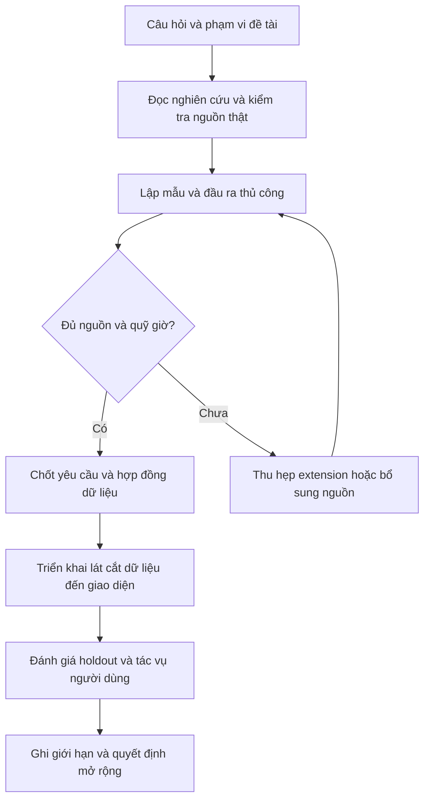
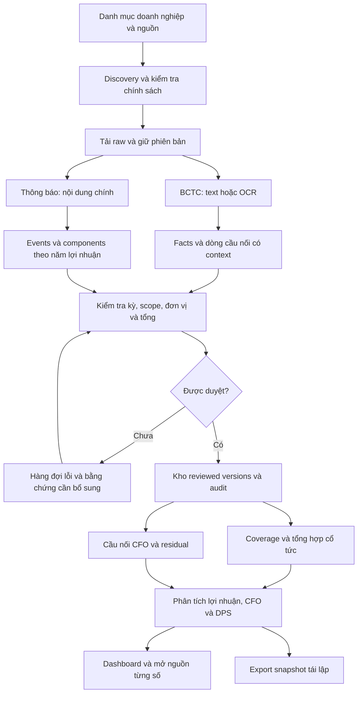

# 05 — Thiết kế hệ thống và workflow

Thiết kế đề xuất, chưa là xác nhận module đã triển khai. Dùng stack và schema nền của [thiết kế hiện hành](../research-platform/03-kien-truc-va-du-lieu.md): Python, HTTP/parser, PDF/OCR, SQLite, pandas và Streamlit. Không cần thêm microservices hoặc một frontend mới chỉ để mở rộng phân tích.

## 1. Workflow nghiên cứu và phát triển

Artifact ở mỗi bước lần lượt là đề xuất01, sổ nguồn02, ca08, SRS bổ sung06, thiết kế05, hồ sơ đánh giá07. Không cần hoàn thành mọi sơ đồ trước pilot nguồn; thiết kế được sửa theo lỗi thật nhưng phải version hóa.

## 2. Workflow dữ liệu end-to-end

Nhánh thiếu dữ liệu có thể ở pending đến cuối project và được báo trong coverage. “Đã tải” không chuyển thẳng thành “đã phân tích”; một lỗi context phải chặn phép tính liên quan.

## 3. Workflow phân tích người dùng

1. Chọn doanh nghiệp, FY, scope và snapshot. Giao diện cho biết coverage và source versions ngay trên trang.
2. Xem LNST/CFO bằng cùng đơn vị; DPS dùng panel riêng VND/cp, không chung trục với VND tổng.
3. Mở một năm lệch đáng chú ý; xem tỷ số hợp lệ và cảnh báo nền âm/missing.
4. Mở cầu nối: điểm đầu LNTT, nhóm điều chỉnh, CFO cuối, residual. Chọn cột so sánh nếu tồn tại; hiển thị nhãn “2024 được trình bày trong BCTC 2025”.
5. Chọn một dòng/nhóm để xem các leaf, trang PDF và raw token. Chưa có thuyết minh giải thích thì ghi “đóng góp số học”, không tự sinh nguyên nhân.
6. Xem các components cổ tức profit_year tương ứng; chuyển sang timeline nếu muốn xem công bố/record/scheduled payment. Thao tác này đổi góc nhìn, không âm thầm đổi định nghĩa biểu đồ.
7. Xuất case gồm facts, phép tính, nguồn và phần chưa biết. Đổi snapshot phải tính lại từ operands cố định của snapshot mới.

## 4. Hợp đồng module bổ sung

| Module đề xuất | Nhận | Trả | Lỗi phải phân biệt |
|---|---|---|---|
| bridge_mapper | Rows, report context, mapping version | Candidates và line roles/groups | Unknown template, ambiguity, missing row |
| bridge_validator | Reviewed leaves và totals | Computed CFO, residual, tolerance, status | Double counting, thiếu leaf, sai scope |
| bridge_compare | Hai bridge tương thích | Delta theo group/leaf, residual delta | Khác layout chưa map được, khác kỳ |
| case_composer | Facts, bridge, dividend aggregate, snapshot | Case có evidence graph | Partial DPS, unmatched scope, source thiếu |

Nhập/duyệt bridge lines thủ công từ nguồn thật là fallback cho extension, phải đếm phút thao tác. Không dùng fallback này để tuyên bố đạt discovery tự động của baseline. LLM nếu dùng chỉ đề xuất mapping/diễn giải; phép tính deterministic và nguồn được duyệt mới là đầu ra chính thức.

## 5. Bảng dữ liệu thêm vào schema nền

| Bảng | Trường quan trọng/ràng buộc |
|---|---|
| bridge_definitions | id, method, start_metric, accounting_regime, mapping_version, valid_period |
| bridge_lines | id, report_version_id, period, scope, raw_label/code, value_vnd, line_role, group_id, parent_line_id, locator, review_id |
| bridge_results | snapshot_id, definition_id, start_fact_id, reported_cfo_fact_id, computed_cfo, residual, tolerance, completeness, status |
| bridge_operands | result_id + operand_id unique, sign/operation, order; mỗi leaf xuất hiện đúng một lần |
| analysis_cases | id, issuer, periods, scope, snapshot, selection_reason, narrative_status |
| case_evidence | case_id, fact/event/bridge/reference id, role |

Không tạo một bảng rộng issuer-year rồi đặt mọi loại cổ tức vào một cột. Bridge thuộc report context; event thuộc security; case nối chúng có điều kiện. DB review và audit cùng transaction. Snapshot lưu cả mapping version, formula version, reviewed operands và coverage để chạy lại không đổi khi parser mới ra đời.

## 6. Cập nhật và replay

Khi raw hash mới xuất hiện: lưu version mới → trích candidate mới → review quan hệ với bản cũ → tính kết quả mới → tạo snapshot mới. Không sửa snapshot đã freeze. Thay lịch thanh toán chỉ đổi timeline; thay mức component mới đổi annual aggregate; thay LNST/CFO mới đổi tỷ số/cầu nối. Impact engine tự tìm mọi case ảnh hưởng là mở rộng tốt nghiệp, còn project phải đủ provenance để kiểm tra thủ công.

## 7. Màn hình và demo đề xuất

Giữ bốn vùng chức năng: nguồn/run và review; tổng quan doanh nghiệp; cầu nối/case; sự kiện/coverage/export. Demo đi từ một thông báo nhiều năm → tách components → dashboard; sau đó một ca lợi nhuận tăng/CFO giảm → cầu nối → mở PDF → export. Đưa một mẫu thiếu dòng vào demo để chứng minh hệ thống biết từ chối kết luận thiếu chứng cứ.
