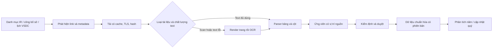

# Kỹ thuật IT cần dùng để crawl và chuẩn hóa dữ liệu mới

Đây là thiết kế dựa trên thử nghiệm ngày 03/10/2026. Các script hiện có là probe nghiên cứu, chưa tích hợp crawler production hay thay [SDD](../initial-docs/SDD-FDP-01.md).

## 1. Pipeline đề xuất

Adapter theo nguồn giúp ứng phó cấu trúc khác nhau: DHG có trang chi tiết, HPG có file host riêng, REE có nhóm và link không mang caption đầy đủ, FPT có media route, VHC trộn ngôn ngữ, VNM có bộ chọn năm, VSDC có bảng thông tin và tin liên quan. Không chọn file chỉ vì anchor có chữ “2025”; giữ title/context, kỳ, scope và mức bảo đảm như ứng viên để duyệt.

## 2. Thu thập ít phụ thuộc và có truy vết

Nguồn ưu tiên: IR chính thức, công bố sở giao dịch và VSDC cho quyền/cổ tức. Phát hiện URL từ trang đã đọc, không đoán API hoặc đổi năm trong URL. Lưu seed, discovery URL, URL cuối, UTC retrieval timestamp, HTTP status, content type, bytes và SHA-256. Publication date phải có locator/nguồn riêng; retrieval time và last-modified không thay được ngày công bố đầu tiên.

Giữ phiên bản theo hash; tải lại cùng URL có nội dung mới phải tạo version, không ghi đè mất bằng chứng. Khi triển khai định kỳ có thể dùng ETag/Last-Modified để giảm tải nếu nguồn hỗ trợ; probe chưa kiểm nghiệm đầy đủ conditional requests. Chỉ có một worker tải trong phép thử, chờ một giây giữa request, timeout 20 giây và trần 30 MiB. Đây là tham số của khảo sát, chưa phải giới hạn website hay chính sách tối ưu đã được đo.

`probe_recent_sources.py` chỉ thực thi seed đã chọn và cờ `probe_allowed`; **không có bộ robots tự động cho mọi URL mới**. Robots đã được đọc và dùng loại sáu seed REE/FPT. Crawler production cần kiểm tra robots/chính sách theo host, xử lý unknown rõ ràng và không tự chuyển sang đường khác nhằm vượt điều kiện đã bị loại. Chưa có CAPTCHA/login trong các đường đã tải; không suy ra mọi nguồn đều không cần adapter đặc biệt.

HNX cho thấy cần xử lý trust store: Python lỗi xác thực, curl Schannel thành công trên cùng nguồn. Có thể cấu hình CA phù hợp hoặc adapter Windows curl với TLS vẫn bật; cần thử cả host trang và host đính kèm. Không đưa `verify=False`/`-k` vào phương án. [Tài liệu curl](https://curl.se/docs/sslcerts.html).

## 3. Đọc PDF theo chất lượng, không chỉ theo có/không text

Đầu tiên thử `pdfplumber`: xác định trang chứa báo cáo chính, đo text, kiểm tra nhãn và khả năng đọc số. HPG Q1 buộc thêm kiểm tra mã chữ lỗi; VHC H1 EN buộc xử lý PDF lai text/scan theo trang. PDF parser mở thành công và đủ byte `%PDF` chỉ xác nhận cấu trúc, không xác nhận đúng tài liệu cần tìm.

Nếu phải OCR, render những trang liên quan bằng Poppler, thử 220 dpi đã chạy, giữ ảnh và kết quả có bounding boxes. Tesseract.js 7.0.0 đã chạy tiếng Việt + Anh; giữ worker cho nhiều trang. Không OCR toàn bộ thuyết minh 60–70 trang chỉ để lấy sáu số ở vài trang chính khi đã xác định đúng vị trí. [Tesseract.js](https://github.com/naptha/tesseract.js), [pdfplumber](https://github.com/jsvine/pdfplumber).

Parser production nên ghép nhãn, mã dòng và tọa độ cột để phân biệt kỳ hiện tại, kỳ trước, riêng quý và lũy kế. Không lấy số đầu tiên trong một cửa sổ ba dòng như quy tắc tổng quát. Xử lý dấu chấm phân cách nghìn, số âm trong ngoặc, đơn vị VND/nghìn/triệu và dấu gạch bằng ngữ cảnh; missing không phải 0. Nếu dùng LLM hỗ trợ chỉ phát sinh ứng viên có nguồn, vẫn phải kiểm định số và vị trí.

## 4. Các trường dữ liệu cần giữ

| Bảng | Trường trọng yếu |
|---|---|
| Document | issuer, source URL, hash, version, publication evidence, retrieved_at, document kind, assurance, language, accounting basis |
| Financial fact | metric, raw label/code/value, normalized value/unit, period start/end/kind, scope, PDF page/printed page/bbox, extraction method, review status |
| Dividend event | source notice ID, ticker, published_at, record_date, scheduled_payment_date, paid_status, confirmed_paid_at |
| Dividend component | event ID, profit_year, DPS, par value, loại tiền mặt/cổ phiếu, evidence locator |
| Coverage / label | expected periods, found/reviewed/missing, searched sources/windows, cutoff, outcome_end, complete/unknown/censored |

Không dùng chỉ `ticker+year` làm khóa duy nhất cho mọi báo cáo: cùng năm có năm/quý/lũy kế, scope riêng/hợp nhất, nhiều phiên bản và ngôn ngữ. Không nhân quan sát vì VHC có hai ngôn ngữ; vẫn giữ hai tài liệu nguồn để đối chiếu. File JSON nghiên cứu chưa triển khai toàn bộ schema này.

## 5. Kiểm định và phân luồng review

Kiểm tra tổng tài sản = nợ phải trả + vốn chủ, đơn vị, kỳ, scope, LNST toàn nhóm/thuộc công ty mẹ; kiểm tra cột trước–sau và các phân loại lại. So sánh số kỳ trước trong báo cáo mới với tài liệu cũ nhưng giữ cả hai bản nếu thay đổi. Chênh lệch không tự động coi là OCR sai.

VSDC: chỉ lấy nội dung thông báo trước “Tin cùng tổ chức”; lấy ticker từ trường mã chứng khoán, không từ keyword trong trang. Gộp hai URL route của cùng notice ID, phân loại cash/stock/bond và thông báo sửa lịch; tách sự kiện nhiều năm lợi nhuận. Script mẫu đã đối chiếu tổng DPS với tổng thành phần nhưng chưa có workflow hủy/thay thế.

Mỗi giá trị đưa lên sản phẩm phải có nguồn và trạng thái duyệt. Nếu thiếu chỉ tiêu hoặc kỳ chưa đủ, trả “chưa đủ dữ liệu” thay vì tính điểm cảnh báo đầy đủ. Nghiệm thu parser cần người chấm khác hoặc bộ holdout theo layout; kết quả 11/12 của probe chỉ là kiểm tra phát triển.

## 6. Cập nhật gần hiện tại

Sau MVP có thể quét danh mục hàng tuần và tăng kiểm tra vào đợt công bố; tần suất là đề xuất, chưa tạo automation. Giữ snapshot `as_of`, kiểm tra phiên bản mới và phạm vi ảnh hưởng rồi tái tính chỉ số cần thiết. Dashboard hiển thị kỳ kết thúc, ngày công bố quan sát, mức bảo đảm và ngày cập nhật để người đọc không nhầm H1/2026 với cả năm 2026.
